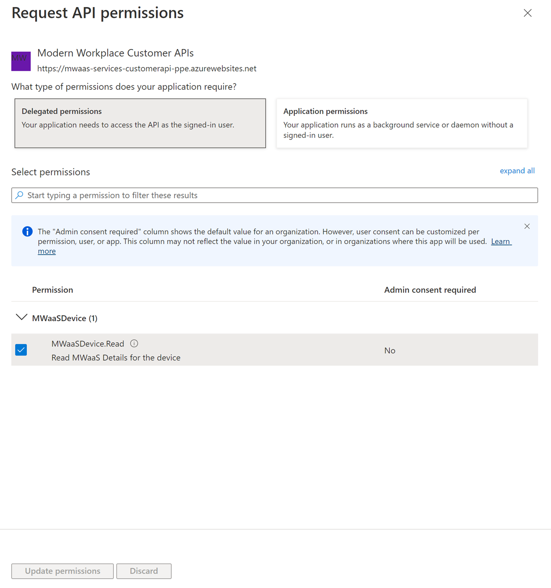
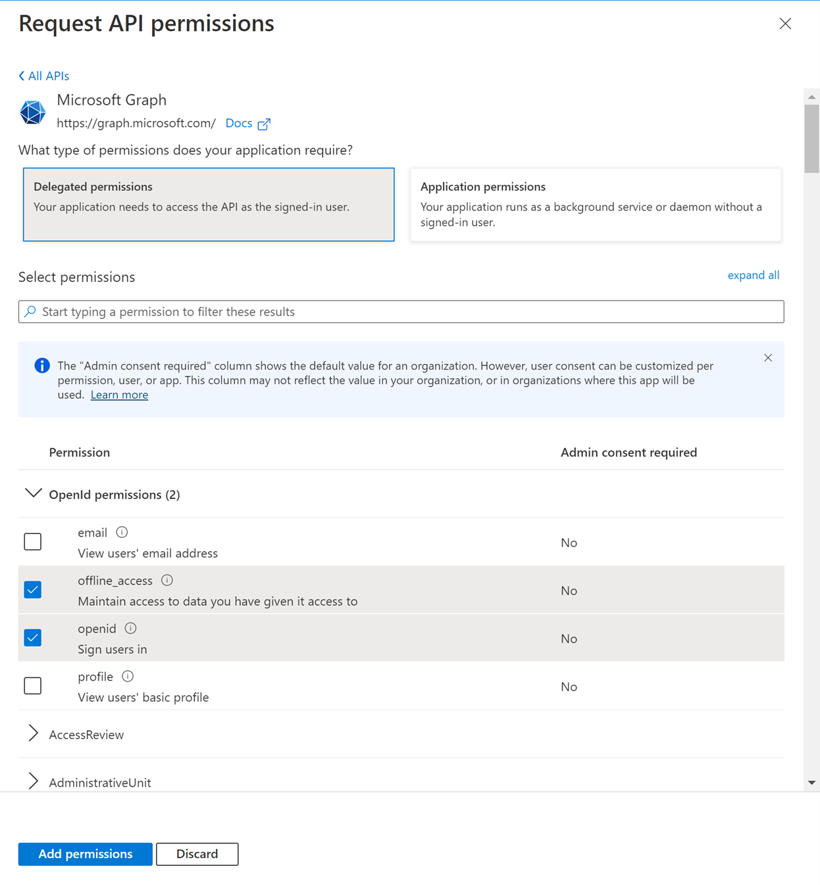

# Get access to API with user context

This article describes how to create an application to get programmatic access to Microsoft Managed Desktop API on behalf of a user.

The API access requires OAuth2.0 authentication. For more information, see [OAuth 2.0 Authorization Code Flow](/azure/active-directory/develop/active-directory-v2-protocols-oauth-code).

**To configure a service and get an access token:**

1. Create and register [an AAD application](/graph/auth-register-app-v2).
1. Configure permissions for Microsoft Managed Desktop on your app.
1. Get administrator consent.
1. Get an access token using this application.
1. Use the token to access Microsoft Managed Desktop API.

## Create an app

To authenticate with the Microsoft identity platform endpoint, you must first register your app at the [Azure app registration portal](https://go.microsoft.com/fwlink/?linkid=2083908).

For a service that will call Microsoft Managed Desktop API under its own identity, you need to register your app for the Web platform and copy the following values:

- The application ID assigned by the Azure app registration portal.
- A client (application) secret, either a password or a public/private key pair (certificate).
- A redirect URL for your service to receive token responses.

For steps on how to configure an app using the Azure app registration portal, see [Register your app](/graph/auth-register-app-v2).

With the OAuth 2.0 client credentials grant flow, your app authenticates directly at the Microsoft identity platform endpoint using the application ID assigned by Azure AD and the client secret that you create using the portal.

### Configure permissions

**To configure delegated permissions for your app in the [Azure app registrations portal](https://go.microsoft.com/fwlink/?linkid=2083908):**

1. Under **your** application's API permissions page, choose **Add a permission \> APIs my organization uses \>** type **Modern Workplace Customer APIs \>** select **Modern Workplace Customer APIs**.
2. Select **Delegated permissions \> MWaaSDevice.Read**, and then select **Add permissions**.

3. To configure additional delegated permissions for your app in the [Azure app registrations portal](https://go.microsoft.com/fwlink/?linkid=2083908), under **your** application's API permissions page, choose **Add a permission \>** choose **Microsoft Graph**.
4. Select **Delegated permissions \>** choose **offline_access** and **openid**, and then select **Add permissions**.


## Get an access token

In the OAuth 2.0 client credentials grant flow, you use the application ID and client secret values that you saved when you registered your app to request an access token directly from the Microsoft identity platform `/token` endpoint.

The first step to getting an access token for the OAuth 2.0 authorization code flow is to redirect the user to the Microsoft identity platform `/authorize` endpoint. Azure Active Directory will sign the user in and request their consent for the permissions your app requests. In the authorization code grant flow, after consent is obtained, Azure AD will return an `authorization_code` to your app that it can redeem at the Microsoft identity platform/token endpoint for an access token.

### Authorization request

In the OAuth 2.0 client credentials grant flow, you use the application ID and client secret values that you saved when you registered your app to request an access token directly from the Microsoft identity platform `/token` endpoint.

```https
https://login.microsoftonline.com/{tenantId}/oauth2/authorize
```

| Parameter | Condition | Description |
| --- | --- | --- |
| tenantId | Required | The tenant’s Azure Active Directory Id. |
| client_id | Required | The application ID assigned when you registered your app. |
| Scope | Required | Must be include: `openid offline_access https://mwaas-services-customerapi-prod.azurewebsites.net/.default` |
| grant_type | Required | Must be `client_credential`. |
| response_type | Required | Must be code. |
| redirect_uri | Recommended | The `redirect_uri` of your app, where authentication responses can be sent and received by your app. It must exactly match one of the `redirect_uris` you registered in the app registration portal. |

### Authorization response

If the user consents to the permissions your app requested, the response will contain the authorization code in the code parameter.

#### Token request

If the user consents to the permissions your app requested, the response will contain the authorization code in the code parameter.

```https
https://login.microsoftonline.com/{tenantId}/oauth2/token
```

| Parameter | Condition | Description |
| --- | --- | --- |
| tenantId | Required | The tenant’s Azure Active Directory Id. |
| client_id | Required | The application ID assigned when you registered your app. |
| Scope | Required | Must be `https://mwaas-services-customerapi-prod.azurewebsites.net/.default` |
| client_secret | Required  | The client secret that you generated for your app in the app registration portal. |
| grant_type | Required  | Must be `authorization_code`. |
| Code | Required | The authorization code acquired as part of authorization request. |

### Token response

A successful JSON response looks like this:

```json
{
    "token_type": "Bearer",
    "expires_in": "3599",
    "access_token": "access_token"
}
```

| Parameter | Description  |
| --- | --- |
| access_token | The requested access token. Your app can use this token in calls to the API. |
| token_type | Must be bearer. |
| expires_in | How long the access token is valid (in seconds). |

#### Use the token to access Microsoft Managed Desktop API

1. Choose the API you want to use.
2. Set the authorization header in the http request you send to "**Bearer {token}**" (Bearer is the authorization scheme).
