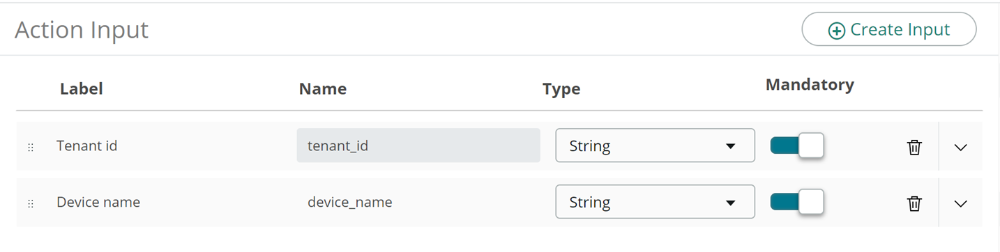
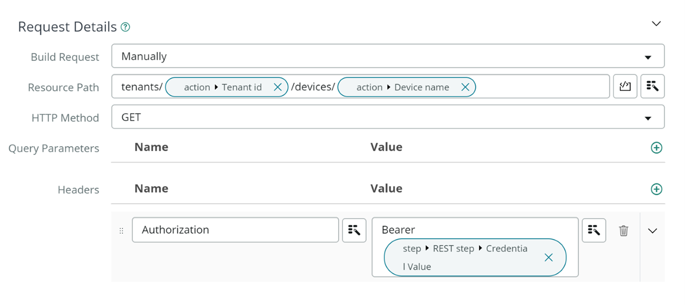

# Configure ServiceNow for Microsoft Managed Desktop API

This article describes how to configure your ServiceNow environment to use the Microsoft Managed Desktop API.

## Before you begin

The scenario outlined in this article assumes that you already have the following prerequisites:

- A ServiceNow instance with Integration Hub subscription.
- A user account with the admin role in ServiceNow.
- Your organization’s ServiceNow instance URL typically looks like `https://<your-organization-domain>.service-now.com`.

### Create an Azure AD app

**To create an Azure AD app:**

1. Register and configure an application in Azure Active Directory with [application context](mmd-api-access-app-context.md) or [user context](mmd-api-access-user-context.md).
2. In **Redirect URI**, enter your ServiceNow instance URL in this format: `https://<Instance-Name>.service-now.com/oauth_redirect.do`.
3. Note the following values:
    1. The client (application) ID assigned by the Azure app registration portal.
    2. The client (application) secret.
4. Add necessary API permissions:
    | Permission | Type |
    | --- | --- |
    | offline_access | Delegated |
    | openid | Delegated |
    | MWaaSDevice.Read | Delegated |

### Register Azure AD as the OAuth provider

**To register Azure AD as the 0Auth provider:**

1. Register and configure an application in Azure Active Directory with application context or user context.
2. Navigate to **All** \> **System OAuth** \> **Application Registry**.
3. Select **New**.
4. The system displays the message **What kind of OAuth application?** Select **Connect to a third party OAuth Provider**.
5. Enter the following values:
    | Field | Value |
    | --- | --- |
    | Name | Enter any name to uniquely identify the record. For example, enter MMD API OAuth. |
    | Client Id | Enter the client (application) ID assigned by the Azure app registration portal. |
    | Client Secret | Enter the client (application) secret. |
    | Default Grant type | Select: <ul><li>Client Credentials for application context.</li><li>Authorization Code for user context.</li></ul>  |
    | Authorization URL | Enter `https://login.microsoftonline.com/{tenantId}/oauth2/v2.0/authorize`. Replace {tenantId} with your Azure AD directory ID. |
    | Token URL | Enter `https://login.microsoftonline.com/{tenantId}/oauth2/v2.0/token`. Replace {tenantId} with your Azure AD directory ID. |
    | Redirect URL | Enter `https://.service-now.com/oauth_redirect.do` |
6. In the **OAuth Entity Scopes** related list, create these entries:
    | Name | OAuth Scope |
    | --- | --- |
    | Enter a unique name for the record, such as `mmd_offlineaccess` | Enter `offline_access` |
    | Enter a unique name for the record, such as `mmd_openid` | Enter openid.|
    | Enter a unique name for the record, such as `mmd_api_user` (For user context) | Enter `https://mwaas-services-customerapi-prod.azurewebsites.net/MmdSupport.ReadWrite` |
    | Enter a unique name for the record, such as `mmd_api_app` (For application context) | Enter `https://mwaas-services-customerapi-prod.azurewebsites.net/.Default` |
7. In the **OAuth Entity Profiles** related list, open the default profile record.
8. Add the entity scopes created based on grant type.

### Create credential records

**To create credential records for the custom app registration you created:**

1. Navigate to **All** \> **System OAuth** \> **Application Registry.**
2. Navigate to **All** \> **Connections & Credentials** \> **Credentials.**
3. Select **New**.
4. The system displays the message **What type of Credentials would you like to create?** Select **OAuth 2.0 Credentials**.
5. Enter the following values:
    | Field  | Value |
    | --- | --- |
    | Name | Enter any name to uniquely identify the record. For example, enter MMD API Credentials. |
    | Active  | Checked |
    | OAuth Entity Profile | Select the OAuth profile you created when you registered the custom Azure AD application as an OAuth provider. For example, select `MMD API OAuth default_profile`. |
6. Select **Submit**.
7. Optional: If you require both the **Authorization Code** and **Client Credentials** grant types to perform certain actions, create a child alias.

### Create connection records

**To create connection records for your Azure AD application:**

1. Navigate to **All** \> **Connections & Credentials** \> **Connection**.
2. Select the **New** button in the Connections related list.
3. Enter these values:
    | Field | Value |
    | --- | --- |
    | Name | Enter any name to uniquely identify the record. For example, enter MMD API Connection. |
    | Credential | Select the Credential record you created for Azure AD. For example, select MMD API Credentials. |
    | Connection URL | Enter `https://mmdls.microsoft.com/support/odata/v1/` |
4. Select **Submit**.

#### Example: Create an action using Microsoft Managed Desktop API

1. Navigate to **Process Automation** \> **Flow Designer**.
1. Select the **New** button and select **Action**.
1. Fill in the **Action Properties** (example GET MMD device details) and select **Submit**.
1. Define action inputs by selecting **+ Create Input**:
    1. Tenant Id
        2. Label:Tenant Id
        1. Name: `tenant_id`
        1. Type: String
        1. Mandatory: Yes
    1. Device Name
        1. Label: Device name
        1. Name: `device_name`
        1. Type: String
        1. Mandatory: Yes

1. Add an action step after Inputs and select **REST** (Perform a REST web service request).
1. Under Connection Details:
1. **Connection**: Use Connection Alias
1. **Connection Alias**: Select the connection alias you’ve previously set up. For example, select MMD API Connection.
1. Confirm **Base URL** auto-populates with `https://mmdls.microsoft.com/support/odata/v1/`.
1. Under Request Details:
1. **Build Request**: Manually
1. **Resource Path**: `tenants/{tenant_Id data pill}/*devices/{device_name data pill}`*Note: drag and drop the data pills of the input variables you created in the previous step.
1. **HTTP Method**: GET
1. **Headers**:
    1. Name: Authorization
    2. Value: Bearer `{Credential Value data pill}`|
1. 
1. Select **Save** to save a draft of your action.
1. Select **Test** to test and validate your new action:
1. Enter your Azure AD directory ID.
1. Enter a valid Microsoft Managed Desktop device name.
1. Select **Run Test**.
1. After Flow Designer is done processing test action, select **Your test has finished running. View the action execution details**, to validate the response.
1. In the **Execution Details** tab that opens, navigate to **ACTION \>** Expand **Steps \> Step Output Data**.
1. Confirm the 200 **Status code** and the JSON in **Response Body** if action was successful.
