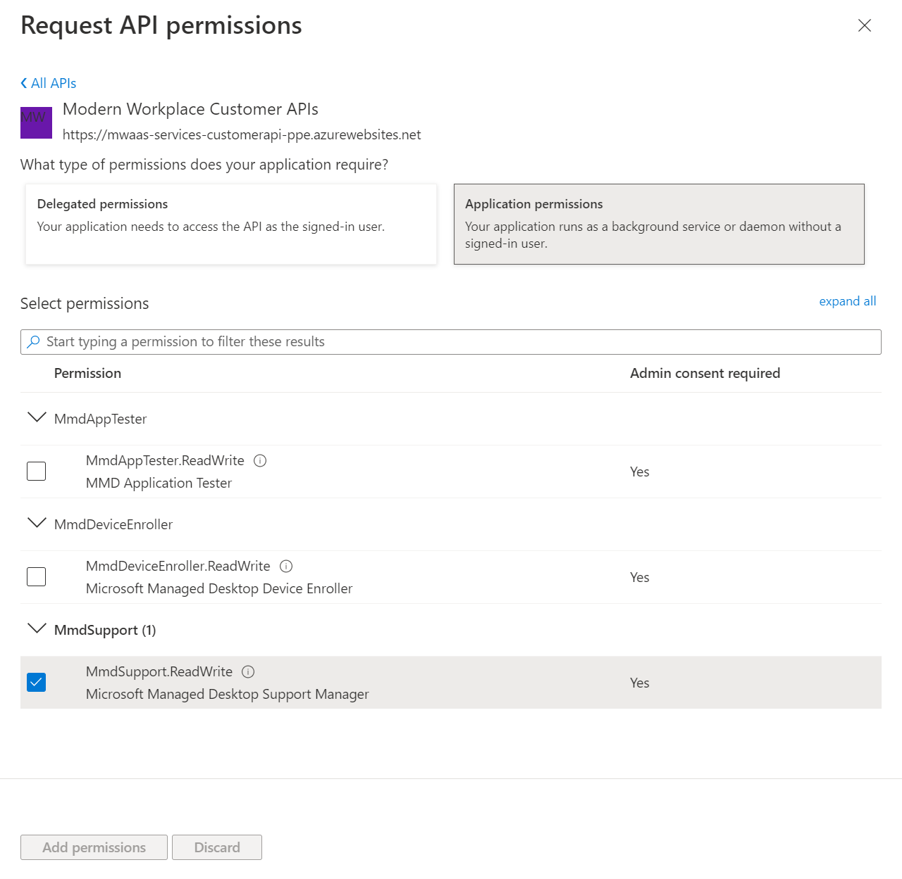

# Microsoft Managed Desktop API

## Overview

The Microsoft Managed Desktop API enables data and capabilities through a set of programmatic APIs that will enable you to automate workflows using your preferred tools.

The API enables you to view and manage devices, support tickets, and elevation requests details as you would through Microsoft Endpoint Manager portal.

Using the API, you can:

- Get a list of devices managed within your tenant and detailed information about each device.

- Get a list of users with their managed devices.

- Create and manage support tickets.

- Create and manage elevation requests.

### Before you begin

In general, you’ll need to take the following steps to use the APIs:

- Create and register [an AAD application](https://docs.microsoft.com/en-us/graph/auth-register-app-v2)

- Configure permissions for Microsoft Managed Desktop on your app

- Get administrator consent or user credential

- Get an access token

- Use the token to access Microsoft Managed Desktop API

For more information, see Get access to API with [application context](#get-access-to-api-with-application-context) or [user context](#get-access-to-api-with-user-context).

## Get access to API with application context

This page describes how to create an application to get programmatic access to Microsoft Managed Desktop API with their own identity and not on behalf of a user.

The API access requires OAuth2.0 authentication. For more information, see [OAuth 2.0 client credentials flow](https://docs.microsoft.com/en-us/azure/active-directory/develop/v2-oauth2-client-creds-grant-flow).

In general, you’ll need to take the following steps to configure a service and get an access token:

- Create and register [an AAD application](https://docs.microsoft.com/en-us/graph/auth-register-app-v2)

- Configure permissions for Microsoft Managed Desktop on your app

- Get administrator consent

- Get an access token using this application

- Use the token to access Microsoft Managed Desktop API

### Create an app

To authenticate with the Microsoft identity platform endpoint, you must first register your app at the [Azure app registration portal](https://go.microsoft.com/fwlink/?linkid=2083908).

For a service that will call Microsoft Managed Desktop API under its own identity, you need to register your app for the Web platform and copy the following values:

- The application ID assigned by the Azure app registration portal.

- A client (application) secret, either a password or a public/private key pair (certificate).

- A redirect URL for your service to receive token responses.

For steps on how to configure an app using the Azure app registration portal, see [Register your app](https://docs.microsoft.com/en-us/graph/auth-register-app-v2).

With the OAuth 2.0 client credentials grant flow, your app authenticates directly at the Microsoft identity platform endpoint using the application ID assigned by Azure AD and the client secret that you create using the portal.

### Configure permissions

1. To configure application permissions for your app in the [Azure app registrations portal](https://go.microsoft.com/fwlink/?linkid=2083908), under **your** application's API permissions page, choose **Add a permission \> APIs my organization uses \>** type **Modern Workplace Customer APIs \>** select **Modern Workplace Customer APIs**

2. Select **Application permissions \> MmdSupport.ReadWrite**, and then select **Add permissions**.



### Get administrator consent

You will need an administrator to grant admin consent for your application.

### Get an access token

For more information on Azure AD tokens, see the [Azure AD tutorial](https://docs.microsoft.com/en-us/azure/active-directory/develop/active-directory-v2-protocols-oauth-client-creds).

In the OAuth 2.0 client credentials grant flow, you use the application ID and client secret values that you saved when you registered your app to request an access token directly from the Microsoft identity platform /token endpoint.

#### Token request

You send a POST request to the /token identity platform endpoint to acquire an access token:

```http
https://login.microsoftonline.com/{tenantId}/oauth2/token
```

| Parameter     | Condition | Description                                                                       |
|---------------|-----------|-----------------------------------------------------------------------------------|
| tenantId      | Required  | The tenant’s Azure Active Directory Id.                                           |
| client_id     | Required  | The application ID assigned when you registered your app.                         |
| Scope         | Required  | Must be https://mwaas-services-customerapi-prod.azurewebsites.net/.default        |
| client_secret | Required  | The client secret that you generated for your app in the app registration portal. |
| grant_type    | Required  | Must be client_credential.                                                        |

#### Token response

A successful response looks like this:

```json
{
    "token_type": "Bearer",
    "expires_in": "3599",
    "access_token": "access_token"
}
```

| Parameter    | Description                                                                  |
|--------------|------------------------------------------------------------------------------|
| access_token | The requested access token. Your app can use this token in calls to the API. |
| token_type   | Must be bearer.                                                              |
| expires_in   | How long the access token is valid (in seconds).                             |

### Use the token to access Microsoft Managed Desktop API

1. Choose the API you want to use.

    1. Step a text
    2. Step b text

2. Set the authorization header in the http request you send to "**Bearer {token}**" (Bearer is the authorization scheme).

## Get access to API with user context

This page describes how to create an application to get programmatic access to Microsoft Managed Desktop API on behalf of a user.

The API access requires OAuth2.0 authentication. For more information, see [OAuth 2.0 Authorization Code Flow](https://docs.microsoft.com/en-us/azure/active-directory/develop/active-directory-v2-protocols-oauth-code).

In general, you’ll need to take the following steps to configure a service and get an access token:

- Create and register [an AAD application](https://docs.microsoft.com/en-us/graph/auth-register-app-v2)
- Configure permissions for Microsoft Managed Desktop on your app
- Get administrator consent
- Get an access token using this application
- Use the token to access Microsoft Managed Desktop API

### Create an app

To authenticate with the Microsoft identity platform endpoint, you must first register your app at the [Azure app registration portal](https://go.microsoft.com/fwlink/?linkid=2083908).

For a service that will call Microsoft Managed Desktop API under its own identity, you need to register your app for the Web platform and copy the following values:

- The application ID assigned by the Azure app registration portal.

- A client (application) secret, either a password or a public/private key pair (certificate).

- A redirect URL for your service to receive token responses.

For steps on how to configure an app using the Azure app registration portal, see [Register your app](https://docs.microsoft.com/en-us/graph/auth-register-app-v2).

With the OAuth 2.0 client credentials grant flow, your app authenticates directly at the Microsoft identity platform endpoint using the application ID assigned by Azure AD and the client secret that you create using the portal.

### Configure permissions

1. To configure delegated permissions for your app in the [Azure app registrations portal](https://go.microsoft.com/fwlink/?linkid=2083908), under **your** application's API permissions page, choose **Add a permission \> APIs my organization uses \>** type **Modern Workplace Customer APIs \>** select **Modern Workplace Customer APIs**

2. Select **Delegated permissions \> MWaaSDevice.Read**, and then select **Add permissions**.


3. To configure additional delegated permissions for your app in the [Azure app registrations portal](https://go.microsoft.com/fwlink/?linkid=2083908), under **your** application's API permissions page, choose **Add a permission \>** choose **Microsoft Graph**

4. Select **Delegated permissions \>** choose **offline_access** and **openid**, and then select **Add permissions**.


### Get an access token

In the OAuth 2.0 client credentials grant flow, you use the application ID and client secret values that you saved when you registered your app to request an access token directly from the Microsoft identity platform /token endpoint.

The first step to getting an access token for the OAuth 2.0 authorization code flow is to redirect the user to the Microsoft identity platform /authorize endpoint. Azure AD will sign the user in and request their consent for the permissions your app requests. In the authorization code grant flow, after consent is obtained, Azure AD will return an authorization_code to your app that it can redeem at the Microsoft identity platform /token endpoint for an access token.

#### Authorization request

In the OAuth 2.0 client credentials grant flow, you use the application ID and client secret values that you saved when you registered your app to request an access token directly from the Microsoft identity platform /token endpoint.

```http
https://login.microsoftonline.com/{tenantId}/oauth2/authorize
```

| Parameter | Condition | Description |
| --- | --- | --- |
| tenantId | Required | The tenant’s Azure Active Directory Id. |
| client_id | Required | The application ID assigned when you registered your app. |
| Scope | Required | Must be include: openid offline_access https://mwaas-services-customerapi-prod.azurewebsites.net/.default |
| grant_type | Required | Must be client_credential. |
| response_type | Required | Must be code. |
| redirect_uri | Recommended | The redirect_uri of your app, where authentication responses can be sent and received by your app. It must exactly match one of the redirect_uris you registered in the app registration portal. |

#### Authorization response

If the user consents to the permissions your app requested, the response will contain the authorization code in the code parameter.

#### Token request

If the user consents to the permissions your app requested, the response will contain the authorization code in the code parameter.

| HTTP                                                      |
|-----------------------------------------------------------|
| https://login.microsoftonline.com/{tenantId}/oauth2/token |

| Parameter     | Condition | Description                                                                       |
|---------------|-----------|-----------------------------------------------------------------------------------|
| tenantId      | Required  | The tenant’s Azure Active Directory Id.                                           |
| client_id     | Required  | The application ID assigned when you registered your app.                         |
| Scope         | Required  | Must be https://mwaas-services-customerapi-prod.azurewebsites.net/.default        |
| client_secret | Required  | The client secret that you generated for your app in the app registration portal. |
| grant_type    | Required  | Must be authorization_code.                                                       |
| Code          | Required  | The authorization code acquired as part of authorization request.                 |

#### Token response

A successful response looks like this:

```json
{
    "token_type": "Bearer",
    "expires_in": "3599",
    "access_token": "access_token"
}
```

| Parameter    | Description                                                                  |
|--------------|------------------------------------------------------------------------------|
| access_token | The requested access token. Your app can use this token in calls to the API. |
| token_type   | Must be bearer.                                                              |
| expires_in   | How long the access token is valid (in seconds).                             |

#### Use the token to access Microsoft Managed Desktop API

1. Choose the API you want to use.

    1. Step a text
    2. Step b text

2. Set the authorization header in the http request you send to "**Bearer {token}**" (Bearer is the authorization scheme).

## Configure ServiceNow for Microsoft Managed Desktop API

This page describes how to configure your ServiceNow environment to use the Microsoft Managed Desktop API.

### Before you begin

The scenario outlined in this tutorial assumes that you already have the following prerequisites:

- A ServiceNow instance with Integration Hub subscription
- A user account with the admin role in ServiceNow
- Your organization’s ServiceNow instance URL typically looks like `https://\<your-organization-domain\>.service-now.com`.

### Create an Azure AD app

1. Register and configure an application in Azure Active Directory with [application context](#get-access-to-api-with-application-context) or [user context](#get-access-to-api-with-user-context).

2. In **Redirect URI**, enter your ServiceNow instance URL in this format: `https://\<Instance-Name\>.service-now.com/oauth_redirect.do`.

3. Note the following values:

    1. The client (application) ID assigned by the Azure app registration portal.
    2. The client (application) secret.

4. Add necessary API permissions:

| Permission       | Type      |
|------------------|-----------|
| offline_access   | Delegated |
| openid           | Delegated |
| MWaaSDevice.Read | Delegated |

### Register Azure AD as OAuth provider

1. Register and configure an application in Azure Active Directory with application context or user context.
2. Navigate to All \> System OAuth \> Application Registry.
3. Click **New**.
4. The system displays the message **What kind of OAuth application?** Select **Connect to a third party OAuth Provider**.
5. Enter these values:

    | Field | Value |
    | --- | --- |
    | Name | Enter any name to uniquely identify the record. For example, enter MMD API OAuth. |
    | Client Id | Enter the client (application) ID assigned by the Azure app registration portal. |
    | Client Secret | Enter the client (application) secret. |
    | Default Grant type | Select:  Client Credentials for application context. Authorization Code for user context.  |
    | Authorization URL | Enter `https://login.microsoftonline.com/{tenantId}/oauth2/v2.0/authorize`. Replace {tenantId} with your Azure AD directory ID. |
    | Token URL | Enter https://login.microsoftonline.com/{tenantId}/oauth2/v2.0/token. Replace {tenantId} with your Azure AD directory ID. |
    | Redirect URL | Enter https://.service-now.com/oauth_redirect.do |

6. In the **OAuth Entity Scopes** related list, create these entries:

    | Name | OAuth Scope |
    |-|-|
    | Enter a unique name for the record, such as mmd_offlineaccess | Enter offline_access |
    | Enter a unique name for the record, such as mmd_openid | Enter openid.|
    | Enter a unique name for the record, such as mmd_api_user (For user context) | Enter `https://mwaas-services-customerapi-ppe.azurewebsites.net/MmdSupport.ReadWrite` |
    | Enter a unique name for the record, such as mmd_api_app (For application context) | Enter `https://mwaas-services-customerapi-ppe.azurewebsites.net/.Default` |

7. In the **OAuth Entity Profiles** related list, open the default profile record.
8. Add the entity scopes created based on grant type.

### Create Credential records

Create Credential records to custom app registration you created.

1. Navigate to **All** \> **System OAuth** \> **Application Registry.**
2. Navigate to **All** \> **Connections & Credentials** \> **Credentials.**
3. Click **New**.
4. The system displays the message **What type of Credentials would you like to create?** Select **OAuth 2.0 Credentials**.
5. Enter these values:

    | Field     | Value    |
    |-----------|----------|
    | Name   | Enter any name to uniquely identify the record. For example, enter MMD API Credentials.  |
    | Active        | Checked   |
    | OAuth Entity Profile | Select the OAuth profile you created when you registered the custom Azure AD application as an OAuth provider. For example, select MMD API OAuth default_profile. |

6. Click **Submit**.
7. Optional: If you require both the **Authorization Code** and **Client Credentials** grant types to perform certain actions, create a child alias.


## Create Connection records

Create Connection records to your Azure AD application.

1.  Navigate to **All** \> **Connections & Credentials** \> **Connection**.

2.  Click the **New** button in the Connections related list.

3.  Enter these values:

| Field          | Value                                                                                           |
|----------------|-------------------------------------------------------------------------------------------------|
| Name           | Enter any name to uniquely identify the record. For example, enter MMD API Connection.          |
| Credential     | Select the Credential record you created for Azure AD. For example, select MMD API Credentials. |
| Connection URL | Enter https://mmdls.microsoft.com/support/odata/v1/                                             |

4.  Click **Submit**.

## Example – Create an action using Microsoft Managed Desktop API

1.  Navigate to **Process Automation** \> **Flow Designer**.

2.  Click the **New** button and select **Action**.

3.  Fill in the **Action Properties** (example GET MMD device details) and click **Submit**.

4.  Define action inputs by selecting **+ Create Input**:

| Label       | Name        | Type   | Mandatory |
|-------------|-------------|--------|-----------|
| Tenant Id   | tenant_id   | String | Yes       |
| Device Name | device_name | String | Yes       |


5.  Add an action step after Inputs and select **REST** (Perform a REST web service request)

6.  Under Connection Details:

    1. **Connection**: Use Connection Alias
    2. **Connection Alias**: Select the connection alias you’ve previously set up. For example, select MMD API Connection.
    3. Confirm **Base URL** auto-populates with https://mmdlsppe.microsoft.com/support/odata/v1/
7. Under Request Details:
    1.  **Build Request**: Manually

    2.  **Resource Path**: tenants/*{tenant_Id data pill}/*devices/{device_name data pill}*  
        *Note: drag and drop the data pills of the input variables you created in the previous step.

    3.  **HTTP Method**: GET

    4.  **Headers**:

| Name          | Value                               |
|---------------|-------------------------------------|
| Authorization | Bearer {Credential Value data pill} |

> 

8.  Select **Save** to save a draft of your action.

9.  Select **Test** to test and validate your new action:

    1.  Enter your Azure AD directory ID.

    2.  Enter a valid Microsoft Managed Desktop device name.

10. Select **Run Test**.

11. After Flow Designer is done processing test action, select **Your test has finished running. View the action execution details**, to validate the response.

12. In the **Execution Details** tab that opens, navigate to **ACTION \>** Expand **Steps \> Step Output Data**.

13. Confirm the 200 **Status code** and the JSON in **Response Body** if action was successful.

# API Schema 

# Devices

Devices registered and managed by Microsoft Managed Desktop.

## Methods

| Method       | Return Type       | Description                |
|--------------|-------------------|----------------------------|
| Get device   | Device            | Get a single device object |
| List devices | Device collection | List device collection     |

## Properties

| Property                      | Type                     | Description                                                                                        |
|-------------------------------|--------------------------|----------------------------------------------------------------------------------------------------|
| name                          | String                   | Name of the device.                                                                                |
| intuneId                      | String                   | Intune identifier for the device.                                                                  |
| manufacturer                  | String                   | Manufacturer of the device.                                                                        |
| model                         | String                   | Model of the device.                                                                               |
| serialNumber                  | String                   | Serial number of the device.                                                                       |
| globalDeviceId                | String                   | Unique identifier of the device.                                                                   |
| enrolledIntoIntuneDateTimeUtc | DateTimeOffset           | Enrollment time of the device.                                                                     |
| tenantId                      | Guid                     | The tenant’s Azure Active Directory Id.                                                            |
| assignedUser                  | String                   | User assigned to the device.                                                                       |
| userUpn                       | String                   | Username of the assigned user.                                                                     |
| userEmail                     | String                   | Email address of the assigned user.                                                                |
| complianceState               | String                   | Compliance state of the device.                                                                    |
| osVersion                     | String                   | OS version.                                                                                        |
| primaryUpdateRing             | String                   | Primary update ring of the device. Possible values are: ‘Test’, ‘First’, ‘Fast’, ‘Broad’.          |
| lastIntuneSyncDateTimeUtc     | DateTimeOffset           | The date and time that the device last completed a successful sync with Intune.                    |
| ageInMonths                   | Single                   | Age of device since enrollment.                                                                    |
| planType                      | String                   |                                                                                                    |
| persona                       | String                   | Device profile. Possible values are: ‘Standard’, ‘SensitiveData’, ’PowerUser’, ’Kiosk’, ’Starter’. |
| aadDeviceId                   | Guid                     | The device’s Azure Active Directory Id.                                                            |
| managementAgent               | String                   | Management channel of the device.                                                                  |
| operatingSystemEdition        | String                   | Operating system edition.                                                                          |
| profileAssignmentStatus       | String                   | Status of profile assignment.                                                                      |
| groups                        | group collection         | List of groups device is assigned to.                                                              |
| configurations                | configuration collection | List of configuration policies assigned to device.                                                 |

# List devices

## API description

Retrieves a list of devices managed by Microsoft Managed Desktop.

Supported [OData V4 query](https://www.odata.org/documentation/) operators:

searchText on name, serialNumber, globalDeviceId, userUpn, userEmail

$skip

$top

## Prerequisites

One of the following permissions is required to call this API. To learn more, including how to choose permissions, see Permissions.

| Permission type | Permissions          |
|-----------------|----------------------|
| Delegated       | MWaaSDevice.Read     |
| Accept          | MmdSupport.ReadWrite |

## HTTP request

```http
GET https://mmdls.microsoft.com/support/odata/v1/tenants/{tenantId}/devices

```

## Request headers

| Header        | Value                         |
|---------------|-------------------------------|
| Authorization | Bearer {token} **(Required)** |
| Accept        | application/json              |

## Request body

Do not supply a request body for this method.

## Response

If successful, this method returns a 200 OK response code and a list of devices in the response body.

## Example 1 – List all devices

### Request

Here is an example of the request.

| HTTP                                                                        |
|-----------------------------------------------------------------------------|
| GET https://mmdls.microsoft.com/support/odata/v1/tenants/{tenantId}/devices |

### Response

Here is an example of the response. **Note:** The response list shown here may be truncated for brevity. All devices will be returned from an actual call.

<table>
<colgroup>
<col style="width: 100%" />
</colgroup>
<thead>
<tr class="header">
<th>JSON</th>
</tr>
</thead>
<tbody>
<tr class="odd">
<td><p>{</p>
<p>    "@odata.context": "https://mmd-support-prod-nam.trafficmanager.net/odata/v1/$metadata#Devices",</p>
<p>    "value": [</p>
<p>        {</p>
<p>            "name": "Device name value",</p>
<p>            "intuneId": "Intune Id Value",</p>
<p>            "manufacturer": "Microsoft Corporation",</p>
<p>            "model": "Surface Laptop",</p>
<p>            "serialNumber": "Serial number value",</p>
<p>            "globalDeviceId": "g:value",</p>
<p>            "enrolledIntoIntuneDateTimeUtc": "2021-11-11T15:01:07.5381567Z",</p>
<p>            "tenantId": "Tenant Id value",</p>
<p>            "tenantName": null,</p>
<p>            "assignedUser": "firstName lastName",</p>
<p>            "userUpn": "username@contoso.onmicrosoft.com",</p>
<p>            "userEmail": "username@contoso.onmicrosoft.com",</p>
<p>            "complianceState": "Compliant",</p>
<p>            "osVersion": "10.0.19043.1586",</p>
<p>            "primaryUpdateRing": "Broad",</p>
<p>            "lastIntuneSyncDateTimeUtc": "2021-04-13T09:19:06.6991927Z",</p>
<p>            "ageInMonths": 13.978561,</p>
<p>            "planType": "Premium",</p>
<p>            "persona": "Standard",</p>
<p>            "aadDeviceId": "aadDevice Id value",</p>
<p>            "managementAgent": "Intune",</p>
<p>            "operatingSystemEdition": "Enterprise",</p>
<p>            "profileAssignmentStatus": "Successful",</p>
<p>            "groups": [],</p>
<p>            "configurations": []</p>
<p>        },</p>
<p>        {</p>
<p>            "name": "Device name value",</p>
<p>            "intuneId": "Intune Id Value",</p>
<p>            "manufacturer": "Microsoft Corporation",</p>
<p>            "model": "Virtual Machine",</p>
<p>            "serialNumber": "Serial number value",</p>
<p>            "globalDeviceId": "g:value",</p>
<p>            "enrolledIntoIntuneDateTimeUtc": "2021-02-25T07:42:07Z",</p>
<p>            "tenantId": "Tenant Id value",</p>
<p>            "tenantName": null,</p>
<p>            "assignedUser": "firstName lastName",</p>
<p>            "userUpn": "username@contoso.onmicrosoft.com",</p>
<p>            "userEmail": "username@contoso.onmicrosoft.com",</p>
<p>            "complianceState": "Compliant",</p>
<p>            "osVersion": "10.0.19043.1586",</p>
<p>            "primaryUpdateRing": "First",</p>
<p>            "lastIntuneSyncDateTimeUtc": "2021-03-16T11:10:04Z",</p>
<p>            "ageInMonths": 1.5491623,</p>
<p>            "planType": "Premium",</p>
<p>            "persona": "Standard",</p>
<p>            "aadDeviceId": "aadDevice Id value",</p>
<p>            "managementAgent": "Intune",</p>
<p>            "operatingSystemEdition": "Enterprise",</p>
<p>            "profileAssignmentStatus": "Successful",</p>
<p>            "groups": [],</p>
<p>            "configurations": []</p>
<p>        },</p>
<p>        {</p>
<p>            "name": "",</p>
<p>            "intuneId": null,</p>
<p>            "manufacturer": "Microsoft Corporation",</p>
<p>            "model": "Surface Pro 4",</p>
<p>            "serialNumber": "Serial number value",</p>
<p>            "globalDeviceId": null,</p>
<p>            "enrolledIntoIntuneDateTimeUtc": null,</p>
<p>            "tenantId": "Tenant Id value",</p>
<p>            "tenantName": null,</p>
<p>            "assignedUser": null,</p>
<p>            "userUpn": null,</p>
<p>            "userEmail": null,</p>
<p>            "complianceState": "Unknown",</p>
<p>            "osVersion": null,</p>
<p>            "primaryUpdateRing": "Test",</p>
<p>            "lastIntuneSyncDateTimeUtc": null,</p>
<p>            "ageInMonths": 11.417163,</p>
<p>            "planType": "Premium",</p>
<p>            "persona": "Standard",</p>
<p>            "aadDeviceId": "aadDevice Id value",</p>
<p>            "managementAgent": null,</p>
<p>            "operatingSystemEdition": null,</p>
<p>            "profileAssignmentStatus": "Successful",</p>
<p>            "groups": [],</p>
<p>            "configurations": []</p>
<p>        }</p>
<p>    ]</p>
<p>}</p></td>
</tr>
</tbody>
</table>

## Example 2 – List devices with filters

### Request

Here is an example to skip the first record and list the next top 2 records.

| HTTP                                                                                     |
|------------------------------------------------------------------------------------------|
| GET https://mmdls.microsoft.com/support/odata/v1/tenants/{tenantId}/devices?skip=1&top=2 |

### Response

Here is an example of the response. **Note:** The response list shown here may be truncated for brevity. All devices will be returned from an actual call.

<table>
<colgroup>
<col style="width: 100%" />
</colgroup>
<thead>
<tr class="header">
<th>JSON</th>
</tr>
</thead>
<tbody>
<tr class="odd">
<td><p>{</p>
<p>    "@odata.context": "https://mmd-support-prod-nam.trafficmanager.net/odata/v1/$metadata#Devices",</p>
<p>    "value": [</p>
<p>        {</p>
<p>            "name": "Device name value",</p>
<p>            "intuneId": "Intune Id Value",</p>
<p>            "manufacturer": "Microsoft Corporation",</p>
<p>            "model": "Virtual Machine",</p>
<p>            "serialNumber": "Serial number value",</p>
<p>            "globalDeviceId": "g:value",</p>
<p>            "enrolledIntoIntuneDateTimeUtc": "2021-02-25T07:42:07Z",</p>
<p>            "tenantId": "Tenant Id value",</p>
<p>            "tenantName": null,</p>
<p>            "assignedUser": "firstName lastName",</p>
<p>            "userUpn": "username@contoso.onmicrosoft.com",</p>
<p>            "userEmail": "username@contoso.onmicrosoft.com",</p>
<p>            "complianceState": "Compliant",</p>
<p>            "osVersion": "10.0.19043.1586",</p>
<p>            "primaryUpdateRing": "First",</p>
<p>            "lastIntuneSyncDateTimeUtc": "2021-03-16T11:10:04Z",</p>
<p>            "ageInMonths": 1.5491623,</p>
<p>            "planType": "Premium",</p>
<p>            "persona": "Standard",</p>
<p>            "aadDeviceId": "aadDevice Id value",</p>
<p>            "managementAgent": "Intune",</p>
<p>            "operatingSystemEdition": "Enterprise",</p>
<p>            "profileAssignmentStatus": "Successful",</p>
<p>            "groups": [],</p>
<p>            "configurations": []</p>
<p>        },</p>
<p>        {</p>
<p>            "name": "",</p>
<p>            "intuneId": null,</p>
<p>            "manufacturer": "Microsoft Corporation",</p>
<p>            "model": "Surface Pro 4",</p>
<p>            "serialNumber": "Serial number value",</p>
<p>            "globalDeviceId": null,</p>
<p>            "enrolledIntoIntuneDateTimeUtc": null,</p>
<p>            "tenantId": "Tenant Id value",</p>
<p>            "tenantName": null,</p>
<p>            "assignedUser": null,</p>
<p>            "userUpn": null,</p>
<p>            "userEmail": null,</p>
<p>            "complianceState": "Unknown",</p>
<p>            "osVersion": null,</p>
<p>            "primaryUpdateRing": "Test",</p>
<p>            "lastIntuneSyncDateTimeUtc": null,</p>
<p>            "ageInMonths": 11.417163,</p>
<p>            "planType": "Premium",</p>
<p>            "persona": "Standard",</p>
<p>            "aadDeviceId": "aadDevice Id value",</p>
<p>            "managementAgent": null,</p>
<p>            "operatingSystemEdition": null,</p>
<p>            "profileAssignmentStatus": "Successful",</p>
<p>            "groups": [],</p>
<p>            "configurations": []</p>
<p>        }</p>
<p>    ]</p>
<p>}</p></td>
</tr>
</tbody>
</table>

## Example 3 – List devices with userUpn

### Request

Returns list of devices based on search of user’s UPN.

| HTTP                                                                                                                |
|---------------------------------------------------------------------------------------------------------------------|
| GET https://mmdls.microsoft.com/support/odata/v1/tenants/{tenantId}/devices?searchText=jdoe@contoso.onmicrosoft.com |

### Response

Here is an example of the response. **Note:** The response list shown here may be truncated for brevity. All devices will be returned from an actual call.

<table>
<colgroup>
<col style="width: 100%" />
</colgroup>
<thead>
<tr class="header">
<th>JSON</th>
</tr>
</thead>
<tbody>
<tr class="odd">
<td><p>{</p>
<p>    "@odata.context": "https://mmd-support-prod-nam.trafficmanager.net/odata/v1/$metadata#Devices",</p>
<p>    "value": [</p>
<p>        {</p>
<p>            "name": "Device name value",</p>
<p>            "intuneId": "Intune Id Value",</p>
<p>            "manufacturer": "Microsoft Corporation",</p>
<p>            "model": "Virtual Machine",</p>
<p>            "serialNumber": "Serial number value",</p>
<p>            "globalDeviceId": "g:value",</p>
<p>            "enrolledIntoIntuneDateTimeUtc": "2021-02-25T07:42:07Z",</p>
<p>            "tenantId": "Tenant Id value",</p>
<p>            "tenantName": null,</p>
<p>            "assignedUser": "John Doe",</p>
<p>            "userUpn": "jdoe@contoso.onmicrosoft.com",</p>
<p>            "userEmail": "jdoe@contoso.onmicrosoft.com",</p>
<p>            "complianceState": "Compliant",</p>
<p>            "osVersion": "10.0.19043.1586",</p>
<p>            "primaryUpdateRing": "First",</p>
<p>            "lastIntuneSyncDateTimeUtc": "2021-03-16T11:10:04Z",</p>
<p>            "ageInMonths": 1.5491623,</p>
<p>            "planType": "Premium",</p>
<p>            "persona": "Standard",</p>
<p>            "aadDeviceId": "aadDevice Id value",</p>
<p>            "managementAgent": "Intune",</p>
<p>            "operatingSystemEdition": "Enterprise",</p>
<p>            "profileAssignmentStatus": "Successful",</p>
<p>            "groups": [],</p>
<p>            "configurations": []</p>
<p>        }</p>
<p>    ]</p>
<p>}</p></td>
</tr>
</tbody>
</table>

# Get device by device name

## API description

Retrieves a device by its device name.

## Prerequisites

One of the following permissions is required to call this API. To learn more, including how to choose permissions, see Permissions.

| Permission type | Permissions          |
|-----------------|----------------------|
| Delegated       | MWaaSDevice.Read     |
| Accept          | MmdSupport.ReadWrite |

## HTTP request

| HTTP                                                                                     |
|------------------------------------------------------------------------------------------|
| GET https://mmdls.microsoft.com/support/odata/v1/tenants/{tenantId}/devices/{devicename} |

## Request headers

| Header        | Value                         |
|---------------|-------------------------------|
| Authorization | Bearer {token} **(Required)** |
| Accept        | application/json              |

## Request body

Do not supply a request body for this method.

## Response

If successful, this method returns a 200 OK response code and a list of devices in the response body.

## Example

### Request

Here is an example of the request.

| HTTP                                                                                      |
|-------------------------------------------------------------------------------------------|
| GET https://mmdls.microsoft.com/support/odata/v1/tenants/{tenantId}/devices/MMD-123456789 |

### Response

Here is an example of the response. **Note:** The response list shown here may be truncated for brevity. All devices will be returned from an actual call.


<table>
<colgroup>
<col style="width: 100%" />
</colgroup>
<thead>
<tr class="header">
<th>JSON</th>
</tr>
</thead>
<tbody>
<tr class="odd">
<td><p>{</p>
<p>    "@odata.context": "https://mmd-support-prod-nam.trafficmanager.net/odata/v1/$metadata#Devices/$entity",</p>
<p>    "name": "MMD-123456789",</p>
<p>    "intuneId": "Intune Id value",</p>
<p>    "manufacturer": "Microsoft Corporation",</p>
<p>    "model": "Virtual Machine",</p>
<p>    "serialNumber": "Serial number value",</p>
<p>    "globalDeviceId": "g:value",</p>
<p>    "enrolledIntoIntuneDateTimeUtc": "2021-07-05T09:22:13.729238Z",</p>
<p>    "tenantId": "Tenant Id value",</p>
<p>    "tenantName": null,</p>
<p>    "assignedUser": "firstName lastName",</p>
<p>    "userUpn": "username@contoso.onmicrosoft.com",</p>
<p>    "userEmail": "username@contoso.onmicrosoft.com",</p>
<p>    "complianceState": "NonCompliant",</p>
<p>    "osVersion": "10.0.19043.1586",</p>
<p>    "primaryUpdateRing": "Test",</p>
<p>    "lastIntuneSyncDateTimeUtc": "2021-04-13T04:37:09.6615599Z",</p>
<p>    "ageInMonths": 9.274547,</p>
<p>    "planType": "Premium",</p>
<p>    "persona": "Standard",</p>
<p>    "aadDeviceId": "aadDeviceId",</p>
<p>    "managementAgent": "Intune",</p>
<p>    "operatingSystemEdition": "Enterprise",</p>
<p>    "profileAssignmentStatus": "Successful",</p>
<p>    "groups": [</p>
<p>        {</p>
<p>            "id": "46bde30a-9113-4f1e-b169-d9e178f41fa7",</p>
<p>            "displayName": "Modern Workplace Devices-Test",</p>
<p>            "description": "Immediate ring for device rollout",</p>
<p>            "countMembers": null</p>
<p>        },</p>
<p>        {</p>
<p>            "id": "58834fcf-e369-463f-9405-e856e8de60f6",</p>
<p>            "displayName": "Modern Workplace Device Profiles - Standard",</p>
<p>            "description": "Devices with a secure experience",</p>
<p>            "countMembers": null</p>
<p>        }</p>
<p>        ...</p>
<p>    ],</p>
<p>    "configurations": [</p>
<p>        {</p>
<p>            "id": "57dc3bb4-7b7f-4052-b9af-0a9c31586e9e",</p>
<p>            "type": "Policy",</p>
<p>            "name": "Modern Workplace - Standard Device Profile Configuration",</p>
<p>            "version": "1",</p>
<p>            "createdUtc": "2021-06-22T01:29:53.4328287Z",</p>
<p>            "lastModifiedUtc": "2021-06-22T01:29:53.4328287Z",</p>
<p>            "deploymentStatus": "Compliant",</p>
<p>            "lastReportedStatusUtc": "2021-02-09T07:44:52.6201692Z"</p>
<p>        },</p>
<p>        {</p>
<p>            "id": "1d576a6f-d0b9-4df7-ba3c-1216965caa3d",</p>
<p>            "type": "Policy",</p>
<p>            "name": "Modern Workplace - Edge Update Policy [Test]",</p>
<p>            "version": "2",</p>
<p>            "createdUtc": "2021-11-09T00:57:00.2017126Z",</p>
<p>            "lastModifiedUtc": "2021-12-22T20:38:39.5457039Z",</p>
<p>            "deploymentStatus": "Compliant",</p>
<p>            "lastReportedStatusUtc": "2021-02-09T07:44:52.6201692Z"</p>
<p>        },</p>
<p>        {</p>
<p>            "id": "f0cb96d3-527f-4532-8675-1518f7aa813f",</p>
<p>            "type": "Script",</p>
<p>            "name": "Modern Workplace - Configure AppV",</p>
<p>            "version": "0",</p>
<p>            "createdUtc": "2021-07-21T02:00:31.1331001Z",</p>
<p>            "lastModifiedUtc": "2021-07-21T02:00:31.1331001Z",</p>
<p>            "deploymentStatus": "Success",</p>
<p>            "lastReportedStatusUtc": "2021-02-09T07:51:06Z"</p>
<p>        },</p>
<p>        {</p>
<p>            "id": "ba8215d7-1aed-4a77-8546-62b1e1a5a981",</p>
<p>            "type": "App",</p>
<p>            "name": "Modern Workplace - Teams Machine Wide Installer x32",</p>
<p>            "version": "",</p>
<p>            "createdUtc": "2021-02-05T19:26:46.6049199Z",</p>
<p>            "lastModifiedUtc": "2021-10-20T17:28:49.654275Z",</p>
<p>            "deploymentStatus": "NotApplicable",</p>
<p>            "lastReportedStatusUtc": "0001-01-01T00:00:00Z"</p>
<p>        }</p>
<p>        ...</p>
<p>    ]</p>
<p>}</p></td>
</tr>
</tbody>
</table>

# Users

Users assigned to Microsoft Managed Desktop devices.

## Methods

| Method     | Return Type       | Description                          |
|------------|-------------------|--------------------------------------|
| Get user   | Device            | Get a single user object             |
| List users | Device collection | List user and associated collections |

## Properties

| Property | Type                      | Description                             |
|----------|---------------------------|-----------------------------------------|
| name     | String                    | Full name of the user.                  |
| upn      | String                    | Username.                               |
| email    | String                    | Email address.                          |
| devices  | devices collection        | List of devices assigned to the user.   |
| groups   | configurations collection | List of groups the user is assigned to. |

# List users

## API description

Retrieves a list of users that are assigned devices managed by Microsoft Managed Desktop.

Supported [OData V4 query](https://www.odata.org/documentation/) operators:

searchText on name, upn, email, serialNumber, devices name

$skip

$top

## Prerequisites

One of the following permissions is required to call this API. To learn more, including how to choose permissions, see Permissions.

| Permission type | Permissions          |
|-----------------|----------------------|
| Delegated       | MWaaSDevice.Read     |
| Accept          | MmdSupport.ReadWrite |

## HTTP request

| HTTP                                                                      |
|---------------------------------------------------------------------------|
| GET https://mmdls.microsoft.com/support/odata/v1/tenants/{tenantId}/users |

## Request headers

| Header        | Value                         |
|---------------|-------------------------------|
| Authorization | Bearer {token} **(Required)** |
| Accept        | application/json              |

## Request body

Do not supply a request body for this method.

## Response

If successful, this method returns a 200 OK response code and a list of devices in the response body.

## Example 1 – List all users

### Request

Here is an example of the request.

| HTTP                                                                      |
|---------------------------------------------------------------------------|
| GET https://mmdls.microsoft.com/support/odata/v1/tenants/{tenantId}/users |

### Response

Here is an example of the response. **Note:** The response list shown here may be truncated for brevity. All users will be returned from an actual call.

```json
    "@odata.context": "https://mmd-support-prod-nam.trafficmanager.net/odata/v1/$metadata#Users",</p>
    "value": [
        {
            "name": "User Name",
            "upn": "username@contoso.onmicrosoft.com",
            "email": "username@contoso.onmicrosoft.com",
            "groups": [],
            "devices": [
                {
                    "serialNumber": "Serial number value",
                    "name": "Device Name value",
                    "model": "Surface Laptop",
                    "ring": "Broad",
                    "lastIntuneSyncTime": "2021-04-13T09:19:06.6991927Z"
                }
            ]
        },
        {
            "name": "User Name",
            "upn": "username@contoso.onmicrosoft.com",
            "email": "username@contoso.onmicrosoft.com",
            "groups": [],
            "devices": [
                {
                    "serialNumber": "Serial number value",
                    "name": "Device Name value",
                    "model": "Virtual Machine",
                    "ring": "First",
                    "lastIntuneSyncTime": "2021-03-16T11:10:04Z"
                }
            ]
        },
        {
            "name": "User Name",
            "upn": "username@contoso.onmicrosoft.com",
            "email": "username@contoso.onmicrosoft.com",
            "groups": [],
            "devices": [
                {
                    "serialNumber": "Serial number value",
                    "name": "Device Name value",
                    "model": "Virtual Machine",
                    "ring": "Test",
                    "lastIntuneSyncTime": "2021-04-13T12:14:02.968959Z"
                },
                {
                    "serialNumber": "Serial number value",
                    "name": "Device Name value",
                    "model": "Virtual Machine",
                    "ring": "Test",
                    "lastIntuneSyncTime": "2021-03-17T17:52:04.8631737Z"
                },
                {
                    "serialNumber": "Serial number value",
                    "name": "Device Name value",
                    "model": "Virtual Machine",
                    "ring": "First",
                    "lastIntuneSyncTime": "2021-03-09T07:10:26Z"
                }
            ]
        }
        
    ]
}

```

### Example 2 – List users with filters

#### Request

Here is an example to skip the first record and list the next top 2 records.

```http
GET https://mmdls.microsoft.com/support/odata/v1/tenants/{tenantId}/users?skip=1&top=2
```

### Response

Here is an example of the response. **Note:** The response list shown here may be truncated for brevity. All users will be returned from an actual call.

<table>
<colgroup>
<col style="width: 100%" />
</colgroup>
<thead>
<tr class="header">
<th>JSON</th>
</tr>
</thead>
<tbody>
<tr class="odd">
<td><p>{</p>
<p>    "@odata.context": "https://mmd-support-prod-nam.trafficmanager.net/odata/v1/$metadata#Users",</p>
<p>    "value": [</p>
<p>        {</p>
<p>            "name": "User Name",</p>
<p>            "upn": "username@contoso.onmicrosoft.com",</p>
<p>            "email": "username@contoso.onmicrosoft.com",</p>
<p>            "groups": [],</p>
<p>            "devices": [</p>
<p>                {</p>
<p>                    "serialNumber": "Serial number value",</p>
<p>                    "name": "Device Name value",</p>
<p>                    "model": "Virtual Machine",</p>
<p>                    "ring": "First",</p>
<p>                    "lastIntuneSyncTime": "2021-03-16T11:10:04Z"</p>
<p>                }</p>
<p>            ]</p>
<p>        },</p>
<p>        {</p>
<p>            "name": "User Name",</p>
<p>            "upn": "username@contoso.onmicrosoft.com",</p>
<p>            "email": "username@contoso.onmicrosoft.com",</p>
<p>            "groups": [],</p>
<p>            "devices": [</p>
<p>                {</p>
<p>                    "serialNumber": "Serial number value",</p>
<p>                    "name": "Device Name value",</p>
<p>                    "model": "Virtual Machine",</p>
<p>                    "ring": "Test",</p>
<p>                    "lastIntuneSyncTime": "2021-04-13T12:14:02.968959Z"</p>
<p>                },</p>
<p>                {</p>
<p>                    "serialNumber": "Serial number value",</p>
<p>                    "name": "Device Name value",</p>
<p>                    "model": "Virtual Machine",</p>
<p>                    "ring": "Test",</p>
<p>                    "lastIntuneSyncTime": "2021-03-17T17:52:04.8631737Z"</p>
<p>                },</p>
<p>                {</p>
<p>                    "serialNumber": "Serial number value",</p>
<p>                    "name": "Device Name value",</p>
<p>                    "model": "Virtual Machine",</p>
<p>                    "ring": "First",</p>
<p>                    "lastIntuneSyncTime": "2021-03-09T07:10:26Z"</p>
<p>                }</p>
<p>            ]</p>
<p>        }</p>
<p>        ...</p>
<p>    ]</p>
<p>}</p></td>
</tr>
</tbody>
</table>

## Example 3 – List users by searchText

### Request

Returns user with assigned device based on device name.

| HTTP                                                                                              |
|---------------------------------------------------------------------------------------------------|
| GET https://mmdls.microsoft.com/support/odata/v1/tenants/{tenantId}/users?searchText={deviceName} |

### Response

Here is an example of the response. **Note:** The response list shown here may be truncated for brevity. All users will be returned from an actual call.

<table>
<colgroup>
<col style="width: 100%" />
</colgroup>
<thead>
<tr class="header">
<th>JSON</th>
</tr>
</thead>
<tbody>
<tr class="odd">
<td><p>{</p>
<p>    "@odata.context": "https://mmd-support-prod-nam.trafficmanager.net/odata/v1/$metadata#Users",</p>
<p>    "value": [</p>
<p>        {</p>
<p>            "name": "User Name",</p>
<p>            "upn": "username@contoso.onmicrosoft.com",</p>
<p>            "email": "username@contoso.onmicrosoft.com",</p>
<p>            "groups": [],</p>
<p>            "devices": [</p>
<p>                {</p>
<p>                    "serialNumber": "Serial number value",</p>
<p>                    "name": "Device Name value",</p>
<p>                    "model": "Virtual Machine",</p>
<p>                    "ring": "First",</p>
<p>                    "lastIntuneSyncTime": "2021-03-16T11:10:04Z"</p>
<p>                }</p>
<p>            ]</p>
<p>        }</p>
<p>    ]</p>
<p>}</p></td>
</tr>
</tbody>
</table>

# Get user by userUpn

## API description

Retrieves specific user by userUpn.

## Prerequisites

One of the following permissions is required to call this API. To learn more, including how to choose permissions, see Permissions.

| Permission type | Permissions          |
|-----------------|----------------------|
| Delegated       | MWaaSDevice.Read     |
| Accept          | MmdSupport.ReadWrite |

## HTTP request

| HTTP                                                                                |
|-------------------------------------------------------------------------------------|
| GET https://mmdls.microsoft.com/support/odata/v1/tenants/{tenantId}/users/{userUpn} |

## Request headers

| Header        | Value                         |
|---------------|-------------------------------|
| Authorization | Bearer {token} **(Required)** |
| Accept        | application/json              |

## Request body

Do not supply a request body for this method.

## Response

If successful, this method returns a 200 OK response code and user details in the response body.

## Example

### Request

Here is an example of the request.

| HTTP                                                                                                     |
|----------------------------------------------------------------------------------------------------------|
| GET https://mmdls.microsoft.com/support/odata/v1/tenants/{tenantId}/devices/jdoe@contoso.onmicrosoft.com |

### Response

Here is an example of the response.

<table>
<colgroup>
<col style="width: 100%" />
</colgroup>
<thead>
<tr class="header">
<th>JSON</th>
</tr>
</thead>
<tbody>
<tr class="odd">
<td><p>{</p>
<p>    "@odata.context": "https://mmd-support-prod-nam.trafficmanager.net/odata/v1/$metadata#Users",</p>
<p>    "value": [</p>
<p>        {</p>
<p>            "name": "John Doe",</p>
<p>            "upn": "jdoe@contoso.onmicrosoft.com",</p>
<p>            "email": "jdoe@contoso.onmicrosoft.com",</p>
<p>            "groups": [</p>
<p>                {</p>
<p>                    "id": "00000000-0000-0000-0000-000000000000",</p>
<p>                    "displayName": "Group display name",</p>
<p>                    "description": "Group description",</p>
<p>                    "countMembers": null</p>
<p>                }</p>
<p>                ...</p>
<p>            ],</p>
<p>            "devices": [</p>
<p>                {</p>
<p>                    "serialNumber": "Serial number value",</p>
<p>                    "name": "Device Name value",</p>
<p>                    "model": "Virtual Machine",</p>
<p>                    "ring": "First",</p>
<p>                    "lastIntuneSyncTime": "2021-03-16T11:10:04Z"</p>
<p>                }</p>
<p>                ...</p>
<p>            ]</p>
<p>        }</p>
<p>    ]</p>
<p>}</p></td>
</tr>
</tbody>
</table>

# Tickets

## Methods

| Method        | Return Type               | Description                    |
|---------------|---------------------------|--------------------------------|
| Get ticket    | CustomerTicket            | Get details of support ticket. |
| List tickets  | CustomerTicket collection | List all support tickets.      |
| Create ticket | CustomerTicket            | Creates a new support ticket.  |

## Properties

### CustomerTicket

| Property               | Type                  | Description                                             |
|------------------------|-----------------------|---------------------------------------------------------|
| title                  | String                | Name of the device.                                     |
| description            | String                | Detailed description of question or issue.              |
| isPartner              | Boolean               | Is a support partner ticket.                            |
| type                   | TicketType            | Ticket type.                                            |
| category               | TicketCategory        | Ticket category.                                        |
| subcategory            | String                | Ticket subcategory.                                     |
| usersOrDevicesImpacted | Int32                 | Number of users/devices impacted.                       |
| businessImpact         | String                | Describe business impact                                |
| issueFirstNoticed      | DateTimeOffset        | Time when issue was first noticed.                      |
| issueReproduced        | Boolean               | Issue is reproduceable on non-Microsoft Managed device. |
| endUserSupportEngaged  | Boolean               | End user support was engaged.                           |
| troubleshootingSteps   | String                | Description of troubleshooting steps performed.         |
| reproSteps             | String                | Steps to reproduce issue.                               |
| id                     | String                | Ticket Id.                                              |
| severity               | Severity Level        | Ticket severity.                                        |
| state                  | Ticket State          | Ticket State.                                           |
| createdDateTime        | DateTimeOffset        | Time of ticket creation.                                |
| resolvedDateTime       | DateTimeOffset        | Time of ticket resolution.                              |
| contact                | CaseContact           | Case contact object.                                    |
| emails                 | email collection      | List of emails.                                         |
| attachments            | attachment collection | List of attachments.                                    |
| notes                  | notes collection      | List of notes.                                          |

### CaseContact

| Property    | Type   | Description       |
|-------------|--------|-------------------|
| id          | Guid   | Unique identifier |
| givenName   | String | First name.       |
| surname     | String | Last name.        |
| email       | String | Email address.    |
| phoneNumber | String | Phone number.     |

# Create ticket

## API description

Creates a new support ticket.

Adding attachments is not currently supported via the API. To add a file to an existing support ticket, visit the **Service requests** page in the Microsoft Endpoint Manager portal.

Viewing and adding contents to discussions is not currently supported via the API.

## Prerequisites

One of the following permissions is required to call this API. To learn more, including how to choose permissions, see Permissions.

| Permission type | Permissions          |
|-----------------|----------------------|
| Delegated       | MWaaSDevice.Read     |
| Accept          | MmdSupport.ReadWrite |

## HTTP request

| HTTP                                                     |
|----------------------------------------------------------|
| GET https://mmdls.microsoft.com/support/odata/v1/tickets |

## Request headers

| Header        | Value                         |
|---------------|-------------------------------|
| Authorization | Bearer {token} **(Required)** |
| Accept        | application/json              |

## Request body

Do not supply a request body for this method.

| Property               | Required | Type           | Description                                             |
|------------------------|----------|----------------|---------------------------------------------------------|
| title                  | True     | String         | Brief description of question or issue.                 |
| description            | True     | String         | Detailed description.                                   |
| type                   | True     | TicketType     | Ticket type.                                            |
| category               | True     | TicketCategory | Ticket category.                                        |
| subcategory            | True     | String         | Ticket subcategory.                                     |
| usersOrDevicesImpacted |          | Int32          | Number of users/devices impacted.                       |
| businessImpact         |          | String         | Describe business impact                                |
| issueFirstNoticed      |          | String         | Time when issue was first noticed.                      |
| issueReproduced        |          | Boolean        | Issue is reproduceable on non-Microsoft Managed device. |
| endUserSupportEngaged  |          | Boolean        | End user support was engaged.                           |
| troubleshootingSteps   |          | String         | Description of troubleshooting steps performed.         |
| reproSteps             |          | String         | Steps to reproduce issue.                               |
| severity               | True     | Severity Level | Ticket severity.                                        |
| contact                | True     | CaseContact    | Case contact object.                                    |
| givenName              | True     | String         | First name.                                             |
| surname                | True     | String         | Last name.                                              |
| email                  | True     | String         | Email address.                                          |
| phoneNumber            | True     | String         | Phone number.                                           |

## Response

If successful, this method returns a 200 OK response code and a list of devices in the response body.

## Example 1 – Create support ticket to request information

### Request

Here is an example of the request.

| HTTP                                                     |
|----------------------------------------------------------|
| GET https://mmdls.microsoft.com/support/odata/v1/tickets |

<table>
<colgroup>
<col style="width: 100%" />
</colgroup>
<thead>
<tr class="header">
<th>JSON</th>
</tr>
</thead>
<tbody>
<tr class="odd">
<td><p>{</p>
<p>    "title": "Title",</p>
<p>    "description": "Description of ticket",</p>
<p>    "type": "RequestForInformation",</p>
<p>    "category": "Devices",</p>
<p>    "subcategory": "Hardware",</p>
<p>    "severity": 4,</p>
<p>    "contact": {</p>
<p>        "givenName": "John",</p>
<p>        "surname": "Doe",</p>
<p>        "email": "jd@contoso.com",</p>
<p>        "phoneNumber": "phone number",</p>
<p>    }</p>
<p>}</p></td>
</tr>
</tbody>
</table>

### Response

Here is an example of the response.

<table>
<colgroup>
<col style="width: 100%" />
</colgroup>
<thead>
<tr class="header">
<th>JSON</th>
</tr>
</thead>
<tbody>
<tr class="odd">
<td><p>{</p>
<p>    "@odata.context": "https://mmd-support-prod-nam.trafficmanager.net/odata/v1/$metadata#Tickets/$entity",</p>
<p>    "title": "Title",</p>
<p>    "description": "Description",</p>
<p>    "isPartner": false,</p>
<p>    "type": "RequestForInformation",</p>
<p>    "category": "Devices",</p>
<p>    "subcategory": "Hardware",</p>
<p>    "compromiseIndicator": null,</p>
<p>    "usersOrDevicesImpacted": null,</p>
<p>    "relatedAlerts": null,</p>
<p>    "businessImpact": null,</p>
<p>    "issueFirstNoticed": null,</p>
<p>    "issueReproduced": null,</p>
<p>    "endUserSupportEngaged": null,</p>
<p>    "troubleshootingSteps": null,</p>
<p>    "nextActionOwner": "Microsoft",</p>
<p>    "nextActionTime": null,</p>
<p>    "reproSteps": null,</p>
<p>    "id": "Ticket Number",</p>
<p>    "severity": 4,</p>
<p>    "state": "active",</p>
<p>    "createdDateTime": "2021-12-14T04:28:18Z",</p>
<p>    "resolvedDateTime": null,</p>
<p>    "contact": {</p>
<p>        "id": "Unique Id",</p>
<p>        "givenName": "John",</p>
<p>        "surname": "Doe",</p>
<p>        "email": "jd@contoso.com",</p>
<p>        "phoneNumber": "phone number",</p>
<p>        "preferredLanguageId": ""</p>
<p>    },</p>
<p>    "emails": [],</p>
<p>    "attachments": [],</p>
<p>    "notes": []</p>
<p>}</p></td>
</tr>
</tbody>
</table>

## Example 2 – Create a support ticket to request a change

### Request

Here is an example of the request.

| HTTP                                                     |
|----------------------------------------------------------|
| GET https://mmdls.microsoft.com/support/odata/v1/tickets |

<table>
<colgroup>
<col style="width: 100%" />
</colgroup>
<thead>
<tr class="header">
<th>JSON</th>
</tr>
</thead>
<tbody>
<tr class="odd">
<td><p>{</p>
<p>    "title": "Title",</p>
<p>    "description": "Description of ticket",</p>
<p>    "type": "ChangeRequest",</p>
<p>    "category": "Devices",</p>
<p>    "subcategory": " Deployment groups assignment",</p>
<p>    "severity": 4,</p>
<p>    "contact": {</p>
<p>        "givenName": "John",</p>
<p>        "surname": "Doe",</p>
<p>        "email": "jd@contoso.com",</p>
<p>        "phoneNumber": "phone number",</p>
<p>    }</p>
<p>}</p></td>
</tr>
</tbody>
</table>

### Response

Here is an example of the response.

<table>
<colgroup>
<col style="width: 100%" />
</colgroup>
<thead>
<tr class="header">
<th>JSON</th>
</tr>
</thead>
<tbody>
<tr class="odd">
<td><p>{</p>
<p>    "@odata.context": "https://mmd-support-prod-nam.trafficmanager.net/odata/v1/$metadata#Tickets/$entity",</p>
<p>    "title": "Title",</p>
<p>    "description": "Description",</p>
<p>    "isPartner": false,</p>
<p>    "type": "ChangeRequest",</p>
<p>    "category": "Devices",</p>
<p>    "subcategory": " Deployment groups assignment",</p>
<p>    "compromiseIndicator": null,</p>
<p>    "usersOrDevicesImpacted": null,</p>
<p>    "relatedAlerts": null,</p>
<p>    "businessImpact": null,</p>
<p>    "issueFirstNoticed": null,</p>
<p>    "issueReproduced": null,</p>
<p>    "endUserSupportEngaged": null,</p>
<p>    "troubleshootingSteps": null,</p>
<p>    "nextActionOwner": "Microsoft",</p>
<p>    "nextActionTime": null,</p>
<p>    "reproSteps": null,</p>
<p>    "id": "Ticket Number",</p>
<p>    "severity": 4,</p>
<p>    "state": "active",</p>
<p>    "createdDateTime": "2021-12-14T04:28:18Z",</p>
<p>    "resolvedDateTime": null,</p>
<p>    "contact": {</p>
<p>        "id": "Unique Id",</p>
<p>        "givenName": "John",</p>
<p>        "surname": "Doe",</p>
<p>        "email": "jd@contoso.com",</p>
<p>        "phoneNumber": "phone number",</p>
<p>        "preferredLanguageId": ""</p>
<p>    },</p>
<p>    "emails": [],</p>
<p>    "attachments": [],</p>
<p>    "notes": []</p>
<p>}</p></td>
</tr>
</tbody>
</table>

## Example 3 – Create a support ticket for an incident

### Request

Here is an example of the request.

| HTTP                                                     |
|----------------------------------------------------------|
| GET https://mmdls.microsoft.com/support/odata/v1/tickets |

<table>
<colgroup>
<col style="width: 100%" />
</colgroup>
<thead>
<tr class="header">
<th>JSON</th>
</tr>
</thead>
<tbody>
<tr class="odd">
<td><p>{</p>
<p>    "title": "Title",</p>
<p>    "description": "Description of ticket",</p>
<p>    "type": "Incident",</p>
<p>    "category": "Devices",</p>
<p>    "subcategory": "Configuration/Policy",</p>
<p>    "usersOrDevicesImpacted": 100,</p>
<p>    "businessImpact": "Business Impact",</p>
<p>    "issueFirstNoticed": "2021-10-06T07:00:00Z",</p>
<p>    "issueReproduced": true,</p>
<p>    "endUserSupportEngaged": true,</p>
<p>    "troubleshootingSteps": "Describe any troubleshooting steps performed.",</p>
<p>    "severity": 4,</p>
<p>    "contact": {</p>
<p>        "givenName": "John",</p>
<p>        "surname": "Doe",</p>
<p>        "email": "jd@contoso.com",</p>
<p>        "phoneNumber": "+1 888"</p>
<p>    }</p>
<p>}</p></td>
</tr>
</tbody>
</table>

### Response

Here is an example of the response.

<table>
<colgroup>
<col style="width: 100%" />
</colgroup>
<thead>
<tr class="header">
<th>JSON</th>
</tr>
</thead>
<tbody>
<tr class="odd">
<td><p>{</p>
<p>    "@odata.context": "https://mmd-support-prod-nam.trafficmanager.net/odata/v1/$metadata#Tickets/$entity",</p>
<p>    "title": "Title",</p>
<p>    "description": "Description",</p>
<p>    "isPartner": true,</p>
<p>    "type": "Incident",</p>
<p>    "category": "Devices",</p>
<p>    "subcategory": "Configuration/Policy",</p>
<p>    "compromiseIndicator": null,</p>
<p>    "usersOrDevicesImpacted": 100,</p>
<p>    "relatedAlerts": null,</p>
<p>    "businessImpact": "Business Impact",</p>
<p>    "issueFirstNoticed": "2021-10-06T07:00:00Z",</p>
<p>    "issueReproduced": true,</p>
<p>    "endUserSupportEngaged": true,</p>
<p>    "troubleshootingSteps": "Describe any troubleshooting steps performed.",</p>
<p>    "nextActionOwner": "Microsoft",</p>
<p>    "nextActionTime": null,</p>
<p>    "reproSteps": null,</p>
<p>    "id": "Ticket Number",</p>
<p>    "severity": 4,</p>
<p>    "state": "active",</p>
<p>    "createdDateTime": "2021-12-14T04:28:18Z",</p>
<p>    "resolvedDateTime": null,</p>
<p>    "contact": {</p>
<p>        "id": "Unique Id",</p>
<p>        "givenName": "John",</p>
<p>        "surname": "Doe",</p>
<p>        "email": "jd@contoso.com",</p>
<p>        "phoneNumber": "phone number",</p>
<p>        "preferredLanguageId": ""</p>
<p>    },</p>
<p>    "emails": [],</p>
<p>    "attachments": [],</p>
<p>    "notes": []</p>
<p>}</p></td>
</tr>
</tbody>
</table>

**  
**

# List tickets

## API description

Lists all support tickets.

Supported [OData V4 query](https://www.odata.org/documentation/) operators:

$filter

$skip

$top

$orderby

## Prerequisites

One of the following permissions is required to call this API. To learn more, including how to choose permissions, see Permissions.

| Permission type | Permissions          |
|-----------------|----------------------|
| Delegated       | MWaaSDevice.Read     |
| Accept          | MmdSupport.ReadWrite |

## HTTP request

| HTTP                                                     |
|----------------------------------------------------------|
| GET https://mmdls.microsoft.com/support/odata/v1/tickets |

## Request headers

| Header        | Value                         |
|---------------|-------------------------------|
| Authorization | Bearer {token} **(Required)** |
| Accept        | application/json              |

## Request body

Do not supply a request body for this method.

## Response

If successful, this method returns a 200 OK response code and a list of tickets in the response body.

## Example 1 – List tickets

### Request

Here is an example to list the first 50 tickets returned in descending order by **createdDateTime** property.

| HTTP                                                                                                   |
|--------------------------------------------------------------------------------------------------------|
| GET https://mmdls.microsoft.com/support/odata/v1/tickets?$skip=0&$top=50&$orderby=createdDateTime desc |

### Response

Here is an example of the response. **Note:** The response list shown here may be truncated for brevity. All tickets will be returned from an actual call.

<table>
<colgroup>
<col style="width: 100%" />
</colgroup>
<thead>
<tr class="header">
<th>JSON</th>
</tr>
</thead>
<tbody>
<tr class="odd">
<td><p>{</p>
<p>    "@odata.context": "https://mmd-support-prod-nam.trafficmanager.net/odata/v1/$metadata#Tickets",</p>
<p>    "value": [</p>
<p>        {</p>
<p>            "title": "Title",</p>
<p>            "description": "Description",</p>
<p>            "isPartner": true,</p>
<p>            "type": "Incident",</p>
<p>            "category": "Devices",</p>
<p>            "subcategory": "Configuration/Policy",</p>
<p>            "compromiseIndicator": null,</p>
<p>            "usersOrDevicesImpacted": 100,</p>
<p>            "relatedAlerts": null,</p>
<p>            "businessImpact": "Business Impact",</p>
<p>            "issueFirstNoticed": "2021-10-06T07:00:00Z",</p>
<p>            "issueReproduced": true,</p>
<p>            "endUserSupportEngaged": true,</p>
<p>            "troubleshootingSteps": "Describe any troubleshooting steps performed.",</p>
<p>            "nextActionOwner": "Microsoft",</p>
<p>            "nextActionTime": null,</p>
<p>            "reproSteps": null,</p>
<p>            "id": "Ticket Number",</p>
<p>            "severity": 4,</p>
<p>            "state": "active",</p>
<p>            "createdDateTime": "2021-12-14T04:28:18Z",</p>
<p>            "resolvedDateTime": null,</p>
<p>            "contact": {</p>
<p>                "id": "Unique Id",</p>
<p>                "givenName": "John",</p>
<p>                "surname": "Doe",</p>
<p>                "email": "jd@contoso.com",</p>
<p>                "phoneNumber": "phone number",</p>
<p>                "preferredLanguageId": ""</p>
<p>            },</p>
<p>            "emails": [],</p>
<p>            "attachments": [],</p>
<p>            "notes": []</p>
<p>        },</p>
<p>        {</p>
<p>            "title": "Title",</p>
<p>            "description": "Description",</p>
<p>            "isPartner": true,</p>
<p>            "type": "Incident",</p>
<p>            "category": "Devices",</p>
<p>            "subcategory": "Configuration/Policy",</p>
<p>            "compromiseIndicator": null,</p>
<p>            "usersOrDevicesImpacted": 100,</p>
<p>            "relatedAlerts": null,</p>
<p>            "businessImpact": "Business Impact",</p>
<p>            "issueFirstNoticed": "2021-10-06T07:00:00Z",</p>
<p>            "issueReproduced": true,</p>
<p>            "endUserSupportEngaged": true,</p>
<p>            "troubleshootingSteps": "Describe any troubleshooting steps performed.",</p>
<p>            "nextActionOwner": "Microsoft",</p>
<p>            "nextActionTime": null,</p>
<p>            "reproSteps": null,</p>
<p>            "id": "Ticket Number",</p>
<p>            "severity": 4,</p>
<p>            "state": "active",</p>
<p>            "createdDateTime": "2021-12-14T04:28:18Z",</p>
<p>            "resolvedDateTime": null,</p>
<p>            "contact": {</p>
<p>                "id": "Unique Id",</p>
<p>                "givenName": "John",</p>
<p>                "surname": "Doe",</p>
<p>                "email": "jd@contoso.com",</p>
<p>                "phoneNumber": "phone number",</p>
<p>                "preferredLanguageId": ""</p>
<p>            },</p>
<p>            "emails": [],</p>
<p>            "attachments": [],</p>
<p>            "notes": []</p>
<p>        },</p>
<p>        ....</p>
<p>    ]</p>
<p>}</p></td>
</tr>
</tbody>
</table>

## Example 2 – List tickets filtered by title

### Request

Here is an example to list all tickets that contain 'Test'in ticket title

| HTTP                                                                                    |
|-----------------------------------------------------------------------------------------|
| GET https://mmdls.microsoft.com/support/odata/v1/tickets?$filter=contains(title,'Test') |

### Response

Here is an example of the response. **Note:** The response list shown here may be truncated for brevity. All tickets will be returned from an actual call.

<table>
<colgroup>
<col style="width: 100%" />
</colgroup>
<thead>
<tr class="header">
<th>JSON</th>
</tr>
</thead>
<tbody>
<tr class="odd">
<td><p>{</p>
<p>    "@odata.context": "https://mmd-support-prod-nam.trafficmanager.net/odata/v1/$metadata#Tickets",</p>
<p>    "value": [</p>
<p>        {</p>
<p>            "title": "Test ticket 1",</p>
<p>            "description": "Description",</p>
<p>            "isPartner": true,</p>
<p>            "type": "Incident",</p>
<p>            "category": "Devices",</p>
<p>            "subcategory": "Configuration/Policy",</p>
<p>            "compromiseIndicator": null,</p>
<p>            "usersOrDevicesImpacted": 100,</p>
<p>            "relatedAlerts": null,</p>
<p>            "businessImpact": "Business Impact",</p>
<p>            "issueFirstNoticed": "2021-10-06T07:00:00Z",</p>
<p>            "issueReproduced": true,</p>
<p>            "endUserSupportEngaged": true,</p>
<p>            "troubleshootingSteps": "Describe any troubleshooting steps performed.",</p>
<p>            "nextActionOwner": "Microsoft",</p>
<p>            "nextActionTime": null,</p>
<p>            "reproSteps": null,</p>
<p>            "id": "Ticket Number",</p>
<p>            "severity": 4,</p>
<p>            "state": "active",</p>
<p>            "createdDateTime": "2021-12-14T04:28:18Z",</p>
<p>            "resolvedDateTime": null,</p>
<p>            "contact": {</p>
<p>                "id": "Unique Id",</p>
<p>                "givenName": "John",</p>
<p>                "surname": "Doe",</p>
<p>                "email": "jd@contoso.com",</p>
<p>                "phoneNumber": "phone number",</p>
<p>                "preferredLanguageId": ""</p>
<p>            },</p>
<p>            "emails": [],</p>
<p>            "attachments": [],</p>
<p>            "notes": []</p>
<p>        },</p>
<p>        {</p>
<p>            "title": "Test ticket 2",</p>
<p>            "description": "Description",</p>
<p>            "isPartner": true,</p>
<p>            "type": "Change Request",</p>
<p>            "category": "Apps",</p>
<p>            "subcategory": "Other ",</p>
<p>            "compromiseIndicator": null,</p>
<p>            "usersOrDevicesImpacted": 100,</p>
<p>            "relatedAlerts": null,</p>
<p>            "businessImpact": "Business Impact",</p>
<p>            "issueFirstNoticed": "2021-10-06T07:00:00Z",</p>
<p>            "issueReproduced": true,</p>
<p>            "endUserSupportEngaged": true,</p>
<p>            "troubleshootingSteps": "Describe any troubleshooting steps performed.",</p>
<p>            "nextActionOwner": "Microsoft",</p>
<p>            "nextActionTime": null,</p>
<p>            "reproSteps": null,</p>
<p>            "id": "Ticket Number",</p>
<p>            "severity": 4,</p>
<p>            "state": "active",</p>
<p>            "createdDateTime": "2021-12-14T04:28:18Z",</p>
<p>            "resolvedDateTime": null,</p>
<p>            "contact": {</p>
<p>                "id": "Unique Id",</p>
<p>                "givenName": "John",</p>
<p>                "surname": "Doe",</p>
<p>                "email": "jd@contoso.com",</p>
<p>                "phoneNumber": "phone number",</p>
<p>                "preferredLanguageId": ""</p>
<p>            },</p>
<p>            "emails": [],</p>
<p>            "attachments": [],</p>
<p>            "notes": []</p>
<p>        },</p>
<p>        ....</p>
<p>    ]</p>
<p>}</p></td>
</tr>
</tbody>
</table>

## Example 3 – List tickets filtered by state and severity

### Request

Here is an example to list all high severity tickets that are resolved.

| HTTP                                                                                                   |
|--------------------------------------------------------------------------------------------------------|
| GET https://mmdls.microsoft.com/support/odata/v1/tickets?$filter=state eq 'resolved' and severity eq 2 |

### Response

Here is an example of the response. **Note:** The response list shown here may be truncated for brevity. All tickets will be returned from an actual call.

<table>
<colgroup>
<col style="width: 100%" />
</colgroup>
<thead>
<tr class="header">
<th>JSON</th>
</tr>
</thead>
<tbody>
<tr class="odd">
<td><p>{</p>
<p>    "@odata.context": "https://mmd-support-prod-nam.trafficmanager.net/odata/v1/$metadata#Tickets",</p>
<p>    "value": [</p>
<p>        {</p>
<p>            "title": "Test ticket 1",</p>
<p>            "description": "Description",</p>
<p>            "isPartner": true,</p>
<p>            "type": "Incident",</p>
<p>            "category": "Devices",</p>
<p>            "subcategory": "Configuration/Policy",</p>
<p>            "compromiseIndicator": null,</p>
<p>            "usersOrDevicesImpacted": 100,</p>
<p>            "relatedAlerts": null,</p>
<p>            "businessImpact": "Business Impact",</p>
<p>            "issueFirstNoticed": "2021-10-06T07:00:00Z",</p>
<p>            "issueReproduced": true,</p>
<p>            "endUserSupportEngaged": true,</p>
<p>            "troubleshootingSteps": "Describe any troubleshooting steps performed.",</p>
<p>            "nextActionOwner": "Microsoft",</p>
<p>            "nextActionTime": null,</p>
<p>            "reproSteps": null,</p>
<p>            "id": "Ticket Number",</p>
<p>            "severity": 2,</p>
<p>            "state": "resolved",</p>
<p>            "createdDateTime": "2021-12-14T04:28:18Z",</p>
<p>            "resolvedDateTime": null,</p>
<p>            "contact": {</p>
<p>                "id": "Unique Id",</p>
<p>                "givenName": "John",</p>
<p>                "surname": "Doe",</p>
<p>                "email": "jd@contoso.com",</p>
<p>                "phoneNumber": "phone number",</p>
<p>                "preferredLanguageId": ""</p>
<p>            },</p>
<p>            "emails": [],</p>
<p>            "attachments": [],</p>
<p>            "notes": []</p>
<p>        },</p>
<p>        {</p>
<p>            "title": "Test ticket 2",</p>
<p>            "description": "Description",</p>
<p>            "isPartner": true,</p>
<p>            "type": "Change Request",</p>
<p>            "category": "Apps",</p>
<p>            "subcategory": "Other ",</p>
<p>            "compromiseIndicator": null,</p>
<p>            "usersOrDevicesImpacted": 100,</p>
<p>            "relatedAlerts": null,</p>
<p>            "businessImpact": "Business Impact",</p>
<p>            "issueFirstNoticed": "2021-10-06T07:00:00Z",</p>
<p>            "issueReproduced": true,</p>
<p>            "endUserSupportEngaged": true,</p>
<p>            "troubleshootingSteps": "Describe any troubleshooting steps performed.",</p>
<p>            "nextActionOwner": "Microsoft",</p>
<p>            "nextActionTime": null,</p>
<p>            "reproSteps": null,</p>
<p>            "id": "Ticket Number",</p>
<p>            "severity": 2,</p>
<p>            "state": "resolved",</p>
<p>            "createdDateTime": "2021-12-14T04:28:18Z",</p>
<p>            "resolvedDateTime": null,</p>
<p>            "contact": {</p>
<p>                "id": "Unique Id",</p>
<p>                "givenName": "John",</p>
<p>                "surname": "Doe",</p>
<p>                "email": "jd@contoso.com",</p>
<p>                "phoneNumber": "phone number",</p>
<p>                "preferredLanguageId": ""</p>
<p>            },</p>
<p>            "emails": [],</p>
<p>            "attachments": [],</p>
<p>            "notes": []</p>
<p>        },</p>
<p>        ....</p>
<p>    ]</p>
<p>}</p></td>
</tr>
<tr class="even">
<td></td>
</tr>
</tbody>
</table>

**  
**

# Get ticket by ID

## API description

Retrieves specific ticket by its ID.

## Prerequisites

One of the following permissions is required to call this API. To learn more, including how to choose permissions, see Permissions.

| Permission type | Permissions          |
|-----------------|----------------------|
| Delegated       | MWaaSDevice.Read     |
| Accept          | MmdSupport.ReadWrite |

## HTTP request

| HTTP                                                                   |
|------------------------------------------------------------------------|
| GET https://mmdls.microsoft.com/support/odata/v1/tickets('{ticketId}') |

## Request headers

| Header        | Value                         |
|---------------|-------------------------------|
| Authorization | Bearer {token} **(Required)** |
| Accept        | application/json              |

## Request body

Do not supply a request body for this method.

## Response

If successful, this method returns a 200 OK response code and user details in the response body.

## Example

### Request

Here is an example of the request.

| HTTP                                                                            |
|---------------------------------------------------------------------------------|
| GET https://mmdls.microsoft.com/support/odata/v1/tickets('{MMD-1465058-R5V8P}') |

### Response

Here is an example of the response.

<table>
<colgroup>
<col style="width: 100%" />
</colgroup>
<thead>
<tr class="header">
<th>JSON</th>
</tr>
</thead>
<tbody>
<tr class="odd">
<td><p>{</p>
<p>    "@odata.context": "https://mmd-support-prod-nam.trafficmanager.net/odata/v1/$metadata#Tickets/$entity",</p>
<p>    "title": "Title",</p>
<p>    "description": "Description",</p>
<p>    "isPartner": true,</p>
<p>    "type": "Incident",</p>
<p>    "category": "Devices",</p>
<p>    "subcategory": "Configuration/Policy",</p>
<p>    "compromiseIndicator": null,</p>
<p>    "usersOrDevicesImpacted": 100,</p>
<p>    "relatedAlerts": null,</p>
<p>    "businessImpact": "Business Impact",</p>
<p>    "issueFirstNoticed": "2021-10-06T07:00:00Z",</p>
<p>    "issueReproduced": true,</p>
<p>    "endUserSupportEngaged": true,</p>
<p>    "troubleshootingSteps": "Describe any troubleshooting steps performed.",</p>
<p>    "nextActionOwner": "Microsoft",</p>
<p>    "nextActionTime": null,</p>
<p>    "reproSteps": null,</p>
<p>    "id": "MMD-1465058-R5V8P",</p>
<p>    "severity": 2,</p>
<p>    "state": "active",</p>
<p>    "createdDateTime": "2021-12-14T04:28:18Z",</p>
<p>    "resolvedDateTime": null,</p>
<p>    "contact": {</p>
<p>        "id": "Unique Id",</p>
<p>        "givenName": "John",</p>
<p>        "surname": "Doe",</p>
<p>        "email": "jd@contoso.com",</p>
<p>        "phoneNumber": "phone number",</p>
<p>        "preferredLanguageId": ""</p>
<p>    },</p>
<p>    "emails": [],</p>
<p>    "attachments": [],</p>
<p>    "notes": []</p>
<p>}</p></td>
</tr>
</tbody>
</table>

**  
**

# Get ticket notes

## API description

Retrieves all ticket notes created by customer for a specific ticket.

## Prerequisites

One of the following permissions is required to call this API. To learn more, including how to choose permissions, see Permissions.

| Permission type | Permissions          |
|-----------------|----------------------|
| Delegated       | MWaaSDevice.Read     |
| Accept          | MmdSupport.ReadWrite |

## HTTP request

| HTTP                                                                         |
|------------------------------------------------------------------------------|
| GET https://mmdls.microsoft.com/support/odata/v1/tickets('{TicketId}')/notes |

## Request headers

| Header        | Value                         |
|---------------|-------------------------------|
| Authorization | Bearer {token} **(Required)** |
| Accept        | application/json              |

## Request body

Do not supply a request body for this method.

## Response

If successful, this method returns a 200 OK response code and user details in the response body.

## Example

### Request

Here is an example of the request.

| HTTP                                                                                  |
|---------------------------------------------------------------------------------------|
| GET https://mmdls.microsoft.com/support/odata/v1/tickets('{MMD-1465058-R5V8P}')/notes |

### Response

Here is an example of the response.

<table>
<colgroup>
<col style="width: 100%" />
</colgroup>
<thead>
<tr class="header">
<th>JSON</th>
</tr>
</thead>
<tbody>
<tr class="odd">
<td><p>{</p>
<p>    "@odata.context": "https://mmd-support-prod-nam.trafficmanager.net/odata/v1/$metadata#Tickets('MMD-1465058-R5V8P')/notes",</p>
<p>    "value": [</p>
<p>        {</p>
<p>            "id": 0,</p>
<p>            "type": "post",</p>
<p>            "renderType": "html",</p>
<p>            "createdDateTime": "2021-12-14T04:28:18Z",</p>
<p>            "modifiedDateTime": "2021-12-14T04:28:18Z",</p>
<p>            "text": "This is the test note to add",</p>
<p>            "sender": "Sender Id"</p>
<p>        }</p>
<p>    ]</p>
<p>}</p></td>
</tr>
</tbody>
</table>

**  
**

# Add notes to ticket

## API description

Adds notes to specific ticket.

## Prerequisites

One of the following permissions is required to call this API. To learn more, including how to choose permissions, see Permissions.

| Permission type | Permissions          |
|-----------------|----------------------|
| Delegated       | MWaaSDevice.Read     |
| Accept          | MmdSupport.ReadWrite |

## HTTP request

| HTTP                                                                            |
|---------------------------------------------------------------------------------|
| POST https://mmdls.microsoft.com/support/odata/v1/tickets('{TicketId}')/addNote |

## Request headers

| Header        | Value                         |
|---------------|-------------------------------|
| Authorization | Bearer {token} **(Required)** |
| Accept        | application/json              |

## Request body

| Property | Required | Type   | Description                                 |
|----------|----------|--------|---------------------------------------------|
| text     | True     | String | Note to add to ticket for support engineer. |

## Response

If successful, this method returns a 204 response code and no content in response body.

## Example

### Request

Here is an example of a request to add notes to a specific ticket and a second request to retrieve all ticket notes.

<table>
<colgroup>
<col style="width: 100%" />
</colgroup>
<thead>
<tr class="header">
<th>HTTP</th>
</tr>
</thead>
<tbody>
<tr class="odd">
<td><p>POST https://mmdls.microsoft.com/support/odata/v1/tickets('{MMD-1465058-R5V8P}')/addNote</p>
<p>GET https://mmdls.microsoft.com/support/odata/v1/tickets('{MMD-1465058-R5V8P}')/notes</p></td>
</tr>
</tbody>
</table>

<table>
<colgroup>
<col style="width: 100%" />
</colgroup>
<thead>
<tr class="header">
<th>JSON</th>
</tr>
</thead>
<tbody>
<tr class="odd">
<td><p>{    </p>
<p>    "text": "Note to add to ticket"</p>
<p>}</p></td>
</tr>
</tbody>
</table>

### Response

Here is an example of the response.

204 No content

<table>
<colgroup>
<col style="width: 100%" />
</colgroup>
<thead>
<tr class="header">
<th>JSON</th>
</tr>
</thead>
<tbody>
<tr class="odd">
<td><p>{</p>
<p>    "@odata.context": "https://mmd-support-prod-nam.trafficmanager.net/odata/v1/$metadata#Tickets('MMD-1465058-R5V8P')/notes",</p>
<p>    "value": [</p>
<p>        {</p>
<p>            "id": 0,</p>
<p>            "type": "post",</p>
<p>            "renderType": "html",</p>
<p>            "createdDateTime": "2021-12-14T04:28:18Z",</p>
<p>            "modifiedDateTime": "2021-12-14T04:28:18Z",</p>
<p>            "text": "This is the test note 1 to add",</p>
<p>            "sender": "Sender Id"</p>
<p>        },</p>
<p>        {</p>
<p>            "id": 1,</p>
<p>            "type": "post",</p>
<p>            "renderType": "html",</p>
<p>            "createdDateTime": "2021-12-14T04:28:18Z",</p>
<p>            "modifiedDateTime": "2021-12-14T04:28:18Z",</p>
<p>            "text": "Note to add to ticket",</p>
<p>            "sender": "Sender Id"</p>
<p>        }</p>
<p>    ]</p>
<p>}</p></td>
</tr>
</tbody>
</table>

**  
**

# Elevation Requests

## Methods

| Method                   | Return Type                      | Description                          |
|--------------------------|----------------------------------|--------------------------------------|
| Get elevation request    | Elevation request                | Get details of an elevation request. |
| List elevation requests  | Collection of elevation requests | List all elevation requests.         |
| Create elevation request | Elevation request                | Creates a new elevation request.     |
| Close elevation request  | Elevation request                | Closes elevation request.            |

## Properties

### ElevationRequest

| Property                | Type           | Description                                              |
|-------------------------|----------------|----------------------------------------------------------|
| id                      | Guid           | Elevation request id.                                    |
| requestingAgentUpn      | String         | Upn of user requesting elevation.                        |
| partnerTicketId         | String         | Ticket id of support ticket linked to elevation request. |
| deviceName              | String         | Device name.                                             |
| title                   | String         | Title.                                                   |
| category                | String         | Request category.                                        |
| subcategory             | String         | Request subcategory.                                     |
| planOfAction            | String         | Plan of action to resolve case.                          |
| actionsTaken            | String         | Actions taken to resolve case.                           |
| closingAgentUpn         | String         | Upn of user closing elevation request.                   |
| requestCreationTime     | DateTimeOffset | Request creation time.                                   |
| requestClosureTime      | DateTimeOffset | Request closure time.                                    |
| viewerUpns              | Collection     | List of user Upns that have viewed password.             |
| passwordLastUpdatedTime | DateTimeOffset | Last time password was updated on device.                |

**  
**

# Create elevation request

## API description

Create an elevation request for a specific device.

## Prerequisites

One of the following permissions is required to call this API. To learn more, including how to choose permissions, see Permissions.

| Permission type | Permissions          |
|-----------------|----------------------|
| Delegated       | MWaaSDevice.Read     |
| Accept          | MmdSupport.ReadWrite |

## HTTP request

| HTTP                                                                                    |
|-----------------------------------------------------------------------------------------|
| POST https://mmdls.microsoft.com/support/odata/v1 /tenants/{tenantId}/elevationRequests |

## Request headers

| Header        | Value                         |
|---------------|-------------------------------|
| Authorization | Bearer {token} **(Required)** |
| Accept        | application/json              |

## Request body

| Property        | Type   | Description                                              |
|-----------------|--------|----------------------------------------------------------|
| partnerTicketId | String | Ticket id of support ticket linked to elevation request. |
| deviceName      | String | Device name.                                             |
| title           | String | Title.                                                   |
| category        | String | Request category.                                        |
| subcategory     | String | Request subcategory.                                     |
| planOfAction    | String | Plan of action to resolve case.                          |

## Response

If successful, this method returns a 201 Created response code and a list of devices in the response body.

## Example

### Request

Here is an example of the request.

| HTTP                                                                                    |
|-----------------------------------------------------------------------------------------|
| POST https://mmdls.microsoft.com/support/odata/v1 /tenants/{tenantId}/elevationRequests |

<table>
<colgroup>
<col style="width: 100%" />
</colgroup>
<thead>
<tr class="header">
<th>JSON</th>
</tr>
</thead>
<tbody>
<tr class="odd">
<td><p>{</p>
<p>    "PartnerTicketId": "Support Ticket Id",</p>
<p>    "DeviceName": "DeviceName",</p>
<p>    "Title": "Elevation request title",</p>
<p>    "Category": "Office",</p>
<p>    "Subcategory": "Excel",</p>
<p>    "PlanOfAction": "Plan of action using elevation."</p>
<p>}</p></td>
</tr>
</tbody>
</table>

### Response

Here is an example of the response.

<table>
<colgroup>
<col style="width: 100%" />
</colgroup>
<thead>
<tr class="header">
<th>JSON</th>
</tr>
</thead>
<tbody>
<tr class="odd">
<td><p>{</p>
<p>    "@odata.context": "https://mmd-support-prod-nam.trafficmanager.net/odata/v1/$metadata#ElevationRequests/$entity",</p>
<p>    "id": "Elevation Request Id",</p>
<p>    "tenantId": "Tenant Id",</p>
<p>    "partnerId": "Tenant Id",</p>
<p>    "requestingAgentUpn": "user UPN email",</p>
<p>    "partnerTicketId": "Support Ticket Id",</p>
<p>    "deviceName": "DeviceName",</p>
<p>    "title": "Elevation request title",</p>
<p>    "category": "Office",</p>
<p>    "subcategory": "Excel",</p>
<p>    "planOfAction": "Plan of action using elevation.",</p>
<p>    "actionsTaken": "",</p>
<p>    "closingAgentUpn": "",</p>
<p>    "requestCreationTime": "2021-12-14T14:06:25.0338102Z",</p>
<p>    "requestClosureTime": null,</p>
<p>    "requestRenewTime": null,</p>
<p>    "isSuccessfulRequest": true,</p>
<p>    "viewerUpns": [],</p>
<p>    "passwordLastUpdatedTime": "2021-03-16T15:10:36.2066667Z",</p>
<p>    "isDeleted": false,</p>
<p>    "ttl": 7776000,</p>
<p>    "eTag": null</p>
<p>}</p></td>
</tr>
</tbody>
</table>

Here are examples of failed responses.

<table>
<colgroup>
<col style="width: 100%" />
</colgroup>
<thead>
<tr class="header">
<th>JSON</th>
</tr>
</thead>
<tbody>
<tr class="odd">
<td><p>{</p>
<p>    "error": {</p>
<p>        "code": "403",</p>
<p>        "message": "This device has too many open elevation requests."</p>
<p>    }</p>
<p>}</p></td>
</tr>
</tbody>
</table>

<table>
<colgroup>
<col style="width: 100%" />
</colgroup>
<thead>
<tr class="header">
<th>JSON</th>
</tr>
</thead>
<tbody>
<tr class="odd">
<td><p>{</p>
<p>    "error": {</p>
<p>        "code": "404",</p>
<p>        "message": "This device does not exist."</p>
<p>    }</p>
<p>}</p></td>
</tr>
</tbody>
</table>

**  
**

# Close elevation request

## API description

Close an elevation request.

## Prerequisites

One of the following permissions is required to call this API. To learn more, including how to choose permissions, see Permissions.

| Permission type | Permissions          |
|-----------------|----------------------|
| Delegated       | MWaaSDevice.Read     |
| Accept          | MmdSupport.ReadWrite |

## HTTP request

| HTTP                                                                                                          |
|---------------------------------------------------------------------------------------------------------------|
| PATCH https://mmdls.microsoft.com/support/odata/v1 /tenants/{tenantId}/elevationRequests/{elevationRequestId} |

## Request headers

| Header        | Value                         |
|---------------|-------------------------------|
| Authorization | Bearer {token} **(Required)** |
| Accept        | application/json              |

## Request body

| Property     | Type   | Description                    |
|--------------|--------|--------------------------------|
| ActionsTaken | String | Actions taken to resolve case. |

## Response

If successful, this method returns a 204 No Content response code.

## Example

### Request

Here is an example of the request.

| HTTP                                                                                                         |
|--------------------------------------------------------------------------------------------------------------|
| PATCH https://mmdls.microsoft.com/support/odata/v1/tenants/{tenantId}/elevationRequests/{elevationRequestId} |

<table>
<colgroup>
<col style="width: 100%" />
</colgroup>
<thead>
<tr class="header">
<th>JSON</th>
</tr>
</thead>
<tbody>
<tr class="odd">
<td><p>{</p>
<p>    "ActionsTaken" : "Actions taken to resolve case."</p>
<p>}</p></td>
</tr>
</tbody>
</table>

### Response

Here is an example of a success response.

| Response       |
|----------------|
| 204 No Content |

Here are examples of failed responses.

<table>
<colgroup>
<col style="width: 100%" />
</colgroup>
<thead>
<tr class="header">
<th>JSON</th>
</tr>
</thead>
<tbody>
<tr class="odd">
<td><p>{</p>
<p>    "error": {</p>
<p>        "code": "400",</p>
<p>        "message": "This elevation request was already closed."</p>
<p>    }</p>
<p>}</p></td>
</tr>
</tbody>
</table>

<table>
<colgroup>
<col style="width: 100%" />
</colgroup>
<thead>
<tr class="header">
<th>JSON</th>
</tr>
</thead>
<tbody>
<tr class="odd">
<td><p>{</p>
<p>    "error": {</p>
<p>        "code": "404",</p>
<p>        "message": "This elevation request does not exist."</p>
<p>    }</p>
<p>}</p></td>
</tr>
</tbody>
</table>

**  
**

# List elevation requests

## API description

Lists all elevation requests.

Supported [OData V4 query](https://www.odata.org/documentation/) operators:

$filter

$skip

$top

## Prerequisites

One of the following permissions is required to call this API.

| Permission type | Permissions          |
|-----------------|----------------------|
| Delegated       | MWaaSDevice.Read     |
| Accept          | MmdSupport.ReadWrite |

## HTTP request

| HTTP                                                     |
|----------------------------------------------------------|
| GET https://mmdls.microsoft.com/support/odata/v1/tickets |

## Request headers

| Header        | Value                         |
|---------------|-------------------------------|
| Authorization | Bearer {token} **(Required)** |
| Accept        | application/json              |

## Request body

Do not supply a request body for this method.

## Response

If successful, this method returns a 200 OK response code and a list of tickets in the response body.

## Example 1 – List elevation requests

### Request

Here is an example to list the first 2 elevation requests.

| HTTP                                                                    |
|-------------------------------------------------------------------------|
| GET https://mmdls.microsoft.com/support/odata/v1/tickets?$skip=0&$top=2 |

### Response

Here is an example of the response. **Note:** The response list shown here may be truncated for brevity. All elevation requests will be returned from an actual call.

<table>
<colgroup>
<col style="width: 100%" />
</colgroup>
<thead>
<tr class="header">
<th>JSON</th>
</tr>
</thead>
<tbody>
<tr class="odd">
<td><p>{</p>
<p>    "@odata.context": "https://mmd-support-prod-nam.trafficmanager.net/odata/v1/$metadata#ElevationRequests",</p>
<p>    "value": [</p>
<p>        {</p>
<p>            "id": "Elevation Request Id",</p>
<p>            "tenantId": "Tenant Id",</p>
<p>            "partnerId": "Tenant Id",</p>
<p>            "requestingAgentUpn": "user UPN email",</p>
<p>            "partnerTicketId": "Support Ticket Id",</p>
<p>            "deviceName": "Device Name",</p>
<p>            "title": "Elevation request title",</p>
<p>            "category": "Office",</p>
<p>            "subcategory": "Excel",</p>
<p>            "planOfAction": "Plan of action using elevation.",</p>
<p>            "actionsTaken": "",</p>
<p>            "closingAgentUpn": "",</p>
<p>            "requestCreationTime": "2021-12-14T14:06:25.0338102Z",</p>
<p>            "requestClosureTime": null,</p>
<p>            "requestRenewTime": null,</p>
<p>            "isSuccessfulRequest": true,</p>
<p>            "viewerUpns": [],</p>
<p>            "passwordLastUpdatedTime": "2021-03-16T15:10:36.2066667Z",</p>
<p>            "isDeleted": false,</p>
<p>            "ttl": 7776000,</p>
<p>            "eTag": null</p>
<p>        },</p>
<p>        {</p>
<p>            "id": "Elevation Request Id",</p>
<p>            "tenantId": "Tenant Id",</p>
<p>            "partnerId": "Tenant Id",</p>
<p>            "requestingAgentUpn": "user UPN email",</p>
<p>            "partnerTicketId": "Support Ticket Id",</p>
<p>            "deviceName": "Device Name",</p>
<p>            "title": "Elevation request title",</p>
<p>            "category": "Hardware",</p>
<p>            "subcategory": "Device",</p>
<p>            "planOfAction": "Plan of action using elevation.",</p>
<p>            "actionsTaken": "",</p>
<p>            "closingAgentUpn": "",</p>
<p>            "requestCreationTime": "2021-12-14T14:06:25.0338102Z",</p>
<p>            "requestClosureTime": null,</p>
<p>            "requestRenewTime": null,</p>
<p>            "isSuccessfulRequest": true,</p>
<p>            "viewerUpns": [],</p>
<p>            "passwordLastUpdatedTime": "2021-03-16T15:10:36.2066667Z",</p>
<p>            "isDeleted": false,</p>
<p>            "ttl": 7776000,</p>
<p>            "eTag": null</p>
<p>        },</p>
<p>        ....</p>
<p>    ]</p>
<p>}</p></td>
</tr>
</tbody>
</table>

## Example 2 – List elevation requests for a device

### Request

Here is an example to list all elevation requests for a specific device.

| HTTP                                                                                                                            |
|---------------------------------------------------------------------------------------------------------------------------------|
| GET https://mmdls.microsoft.com/support/odata /v1/tenants/{tenantId}/elevationRequests?$filter=deviceName eq ' MMD-03690457680' |

### Response

Here is an example of the response. **Note:** The response list shown here may be truncated for brevity. All elevation requests will be returned from an actual call.

<table>
<colgroup>
<col style="width: 100%" />
</colgroup>
<thead>
<tr class="header">
<th>JSON</th>
</tr>
</thead>
<tbody>
<tr class="odd">
<td><p>{</p>
<p>    "@odata.context": "https://mmd-support-prod-nam.trafficmanager.net/odata/v1/$metadata#ElevationRequests",</p>
<p>    "value": [</p>
<p>        {</p>
<p>            "id": "Elevation Request Id",</p>
<p>            "tenantId": "Tenant Id",</p>
<p>            "partnerId": "Tenant Id",</p>
<p>            "requestingAgentUpn": "user UPN email",</p>
<p>            "partnerTicketId": "Support Ticket Id",</p>
<p>            "deviceName": "MMD-03690457680",</p>
<p>            "title": "Elevation request title",</p>
<p>            "category": "Office",</p>
<p>            "subcategory": "Excel",</p>
<p>            "planOfAction": "Plan of action using elevation.",</p>
<p>            "actionsTaken": "",</p>
<p>            "closingAgentUpn": "",</p>
<p>            "requestCreationTime": "2021-12-14T14:06:25.0338102Z",</p>
<p>            "requestClosureTime": null,</p>
<p>            "requestRenewTime": null,</p>
<p>            "isSuccessfulRequest": true,</p>
<p>            "viewerUpns": [],</p>
<p>            "passwordLastUpdatedTime": "2021-03-16T15:10:36.2066667Z",</p>
<p>            "isDeleted": false,</p>
<p>            "ttl": 7776000,</p>
<p>            "eTag": null</p>
<p>        },</p>
<p>        {</p>
<p>            "id": "Elevation Request Id",</p>
<p>            "tenantId": "Tenant Id",</p>
<p>            "partnerId": "Tenant Id",</p>
<p>            "requestingAgentUpn": "user UPN email",</p>
<p>            "partnerTicketId": "Support Ticket Id",</p>
<p>            "deviceName": "MMD-03690457680",</p>
<p>            "title": "Elevation request title",</p>
<p>            "category": "Hardware",</p>
<p>            "subcategory": "Device",</p>
<p>            "planOfAction": "Plan of action using elevation.",</p>
<p>            "actionsTaken": "",</p>
<p>            "closingAgentUpn": "",</p>
<p>            "requestCreationTime": "2021-12-14T14:06:25.0338102Z",</p>
<p>            "requestClosureTime": null,</p>
<p>            "requestRenewTime": null,</p>
<p>            "isSuccessfulRequest": true,</p>
<p>            "viewerUpns": [],</p>
<p>            "passwordLastUpdatedTime": "2021-03-16T15:10:36.2066667Z",</p>
<p>            "isDeleted": false,</p>
<p>            "ttl": 7776000,</p>
<p>            "eTag": null</p>
<p>        },</p>
<p>        ....</p>
<p>    ]</p>
<p>}</p></td>
</tr>
</tbody>
</table>

## Example 3 – List elevation requests filtered by category

### Request

Here is an example to list all elevation requests with category of ‘Office’.

| HTTP                                                                                                                                     |
|------------------------------------------------------------------------------------------------------------------------------------------|
| GET https://mmd-support-preprod-nam.trafficmanager.net/odata/v1/tenants/{tenantId}/elevationRequests?$filter=contains(category,'Office') |

### Response

Here is an example of the response. **Note:** The response list shown here may be truncated for brevity. All tickets will be returned from an actual call.

<table>
<colgroup>
<col style="width: 100%" />
</colgroup>
<thead>
<tr class="header">
<th>JSON</th>
</tr>
</thead>
<tbody>
<tr class="odd">
<td><p>{</p>
<p>    "@odata.context": "https://mmd-support-prod-nam.trafficmanager.net/odata/v1/$metadata#ElevationRequests",</p>
<p>    "value": [</p>
<p>        {</p>
<p>            "id": "Elevation Request Id",</p>
<p>            "tenantId": "Tenant Id",</p>
<p>            "partnerId": "Tenant Id",</p>
<p>            "requestingAgentUpn": "user UPN email",</p>
<p>            "partnerTicketId": "Support Ticket Id",</p>
<p>            "deviceName": "MMD-03690457680",</p>
<p>            "title": "Elevation request title",</p>
<p>            "category": "Office",</p>
<p>            "subcategory": "Excel",</p>
<p>            "planOfAction": "Plan of action using elevation.",</p>
<p>            "actionsTaken": "",</p>
<p>            "closingAgentUpn": "",</p>
<p>            "requestCreationTime": "2021-12-14T14:06:25.0338102Z",</p>
<p>            "requestClosureTime": null,</p>
<p>            "requestRenewTime": null,</p>
<p>            "isSuccessfulRequest": true,</p>
<p>            "viewerUpns": [],</p>
<p>            "passwordLastUpdatedTime": "2021-03-16T15:10:36.2066667Z",</p>
<p>            "isDeleted": false,</p>
<p>            "ttl": 7776000,</p>
<p>            "eTag": null</p>
<p>        },</p>
<p>        {</p>
<p>            "id": "Elevation Request Id",</p>
<p>            "tenantId": "Tenant Id",</p>
<p>            "partnerId": "Tenant Id",</p>
<p>            "requestingAgentUpn": "user UPN email",</p>
<p>            "partnerTicketId": "Support Ticket Id",</p>
<p>            "deviceName": "MMD-03690457680",</p>
<p>            "title": "Elevation request title",</p>
<p>            "category": "Office",</p>
<p>            "subcategory": "Word",</p>
<p>            "planOfAction": "Plan of action using elevation.",</p>
<p>            "actionsTaken": "",</p>
<p>            "closingAgentUpn": "",</p>
<p>            "requestCreationTime": "2021-12-14T14:06:25.0338102Z",</p>
<p>            "requestClosureTime": null,</p>
<p>            "requestRenewTime": null,</p>
<p>            "isSuccessfulRequest": true,</p>
<p>            "viewerUpns": [],</p>
<p>            "passwordLastUpdatedTime": "2021-03-16T15:10:36.2066667Z",</p>
<p>            "isDeleted": false,</p>
<p>            "ttl": 7776000,</p>
<p>            "eTag": null</p>
<p>        },</p>
<p>        ....</p>
<p>    ]</p>
<p>}</p></td>
</tr>
</tbody>
</table>

**  
**

# Get elevation request details

## API description

Retrieves details of any open elevation request for a specific device.

## Prerequisites

One of the following permissions is required to call this API. To learn more, including how to choose permissions, see Permissions.

| Permission type | Permissions          |
|-----------------|----------------------|
| Delegated       | MWaaSDevice.Read     |
| Accept          | MmdSupport.ReadWrite |

## HTTP request

| HTTP                                                                                                        |
|-------------------------------------------------------------------------------------------------------------|
| GET https://mmdls.microsoft.com/support/odata/ /v1/tenants/{tenantId}/devices/{deviceName}/elevationDetails |

## Request headers

| Header        | Value                         |
|---------------|-------------------------------|
| Authorization | Bearer {token} **(Required)** |
| Accept        | application/json              |

## Request body

Do not supply a request body for this method.

## Response

If successful, this method returns a 200 OK response code and user details in the response body.

## Example

### Request

Here is an example of the request.

| HTTP                                                                                                          |
|---------------------------------------------------------------------------------------------------------------|
| GET https://mmdls.microsoft.com/support/odata/v1/ tenants/{tenantId}/devices/MMD-03690457680/elevationDetails |

### Response

Here is an example of the response.

<table>
<colgroup>
<col style="width: 100%" />
</colgroup>
<thead>
<tr class="header">
<th>JSON</th>
</tr>
</thead>
<tbody>
<tr class="odd">
<td><p>{</p>
<p>    "@odata.context": "https://mmd-support-preprod-nam.trafficmanager.net/odata/v1/$metadata#Microsoft.ManagedDesktop.DeviceElevationDetail",</p>
<p>    "tenantId": "Tenant Id",</p>
<p>    "deviceName": "MMD-03690457680",</p>
<p>    "openedElevationRequestId": "Elevation Request Id",</p>
<p>    "aadDeviceId": "Azure AD device Id",</p>
<p>    "accountUpn": "accountUpn",</p>
<p>    "password": "password",</p>
<p>    "passwordLastUpdated": "2021-03-16T15:10:36.2066667Z",</p>
<p>    "status": "PasswordSucceeded",</p>
<p>    "isPasswordChanged": false,</p>
<p>    "viewedBy": [</p>
<p>        "System"</p>
<p>    ]</p>
<p>}</p></td>
</tr>
</tbody>
</table>
